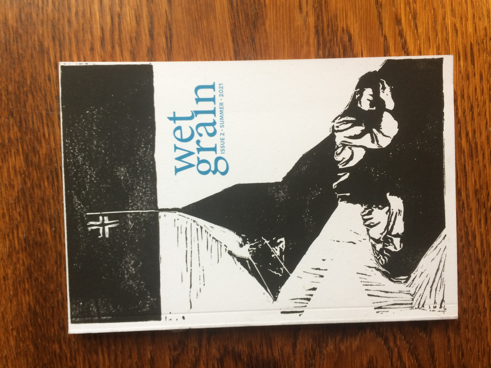
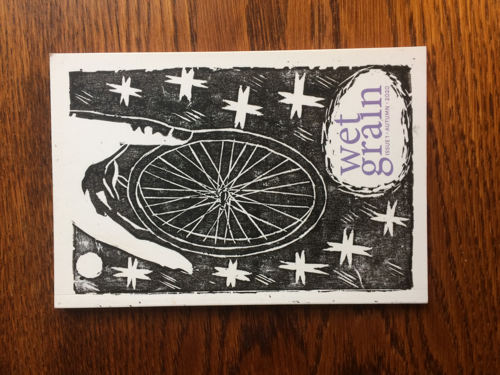

[home](index.md) | [archive](archive.md) | [shop](shop.md)  |  [submit](submit.md)

# about 

Wet Grain is an annual print magazine for new poetry in English. Its fifth, most recent issue, guest-edited by Leo Boix & Nat Teitler FRSL & published in July 2024, spotlighted the work of British Latinx poets.

Since 2020, it has included the work of emerging poets alongside recipients of awards including the Pulitzer, a MacArthur Fellowship, 
the Pushcart Prize, the German Book Prize, and the Eric Gregory. 

Each issue, selected poets are invited to contribute a short piece of commentary on a poem included in the issue. Covers feature commissioned
etchings and are hand-printed, making each copy an original print. 

The magazine was founded by Christian Lemay and Patrick Romero McCafferty.

### Issue Five, Summer 2024, guest-edited by Leo Boix & Nat Teitler

Original artwork by Julia Utreras

Emiliano Gomez / Juana Adcock / Patrizia Longhitano / Yessica Klein / Fiorella Terrazas (trans. Leo Boix) / Flor Bárcenas Feria (trans. Leo Boix) / Adriana Díaz Enciso / Daniela Avendaño (trans. Colin Bramwell) / R. Joseph Rodríguez / Nathalia Samhil Gonzalez Gutierrez / Marina Sánchez / José Buera / Isabel del Rio / Hubert Matiúwàa (trans. Juana Adcock) / Guadalupe Villaseñor (trans. Patrick Romero McCafferty) / Jacob Anthony Ramírez / Eduardo R. de Siqueira / Sim Pereira-Madder

### Issue Four, Summer 2023, guest-edited by Sylee Gore

Original artwork by Elżbieta Wójcik-Leese

Madeleine Lamm / Patrick James Errington / Isabelle Baafi / Caleb Leow / Kathleen Heil / Lutz Seiler (trans. Stefan Tobler) / Heidi Williamson / Sara Larsen / Rusk Wick / Jed Munson / Gabriel Levine Brislin / Paul Stephenson / Rob A, Mackenzie / Agata  Maszlowska / Elzbieta Wojcek-Leese / Alia Zapparova / Nur Turkmani / Laura Theis / Laura Varnam / Cristina Rivera Garza / Laura Davis / Leah Umansky / Tom Branfoot / S.J. Delaney / Imogen Reid / Rise / Roshni Gallagher / Sneha Subramanian Kanta / Lubi Barre / Samuel Tongue / Jamie Cameron / Maggie Wang 

​
### Issue Three, Summer 2022, guest-edited by Nasim Luczaj

 
Original artwork by Rosie Watt

Bob Beagrie / Niall Campbell / Tim Tim Cheng / Ken Cockburn / Silas Curtis / Desree / Cecily Fasham / M.J. Griffin / Jeremy Allan Hawkins / Charles Lang / David Ross Linklater / John Chinaka Onyeche / Ellen Renton / Tawona Sithole / Alan Spence / Carine Topal / Lynn Valentine / Cecilia Woloch

### Issue Two, Summer 2021, co-edited by Christian Lemay

Original artwork by Andreas Christodoulidis

River Ellen MacAskill / Michael W. Thomas / Natalie Chunmin Fong / Liam Welsh / Nasim Luczaj / Alec Finlay / Robin Leiper / Stella Hervey Birrell / Richie McCaffery / Caroline Maldonaldo / Davinia Hamilton / Arthur Allen / Josh Smyth / Jack Bigglestone / Joseph Minden / Shane Johnstone / Deborah Tyler-Bennett / Alice Hill-Woods / Scott Lilley / Alice Lannon / Morag Smith / Samuel Skoog / Edgar M. Caamano / Allie Kerper / Maria Sledmere / Richard Price / Owen Gallagher / Gerry Stewart / Louis Norman / Sylee Gore

​
### Issue One, Autumn 2020, co-edited by Christian Lemay 

Original artwork by Laura Wade
 
Angus Reid / Ken Cockburn / Eloise Birtwhistle / Richard Price / Elle Heedles / Colin Herd / Kirsty Dunlop / Aea Varfis-van Warmelo / T. Person / Samuel Skoog / Martin Breul / Christopher Barkley / Mike Farren / Julie-ann Rowell / Shirley Nicholson / Tinashe Mushakavanhu / Rupert Loydell / Hamish Swanson / George Sandifer-Smith / Scott Lilley / Carl Alexandersson / Olivia Rafferty / Giovanna MacKenna / Stephen Wade / Sylee Gore / Nel Goenas / Janet Murray / David Canning

​

