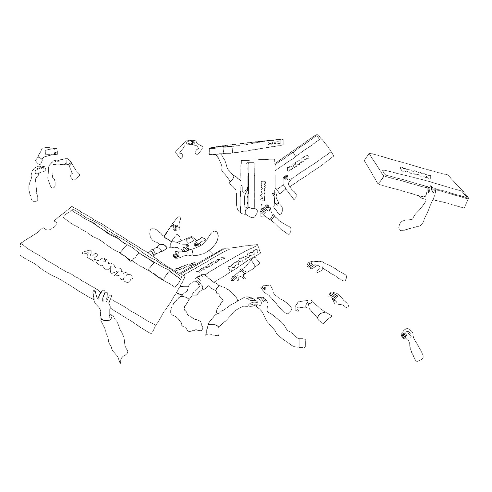
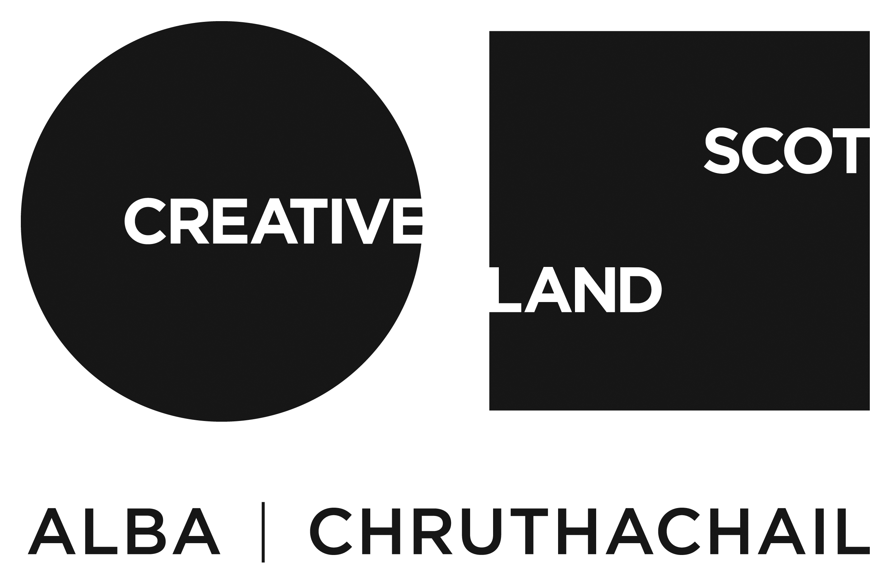

[home](index.md) | [issues](issues.md) | [shop](shop.md)  |  [submissions](submit.md)

## About 

Wet Grain is a magazine for poetry and essays on matters of land-use, provenance, and ownership. It is edited by Patrick Romero McCafferty & Nasim Luczaj.

Its most recent issue (Sept 2025), guest-edited by Charles Lang, Eloise Birtwhistle, & Nasim Luczaj is [available now](shop.md).

Since 2020, the magazine has included the work of emerging poets alongside a Nobel Prize nominee, & recipients of awards including the Pulitzer, the Forward, a MacArthur Fellowship, the Pushcart Prize, the German Book Prize, the Somerset Maugham, and the Eric Gregory. Each issue, selected poets are invited to contribute a short piece of commentary on a poem included in the issue. As of Issue Seven, we will also be publishing essays concerning the above-mentioned topics. Covers feature commissioned etchings and are hand-printed, making each copy an original print. The magazine was founded by Christian Lemay & Patrick Romero McCafferty. Past issues have been guested-edited by Sylee Gore (Issue 4), Leo Boix & Nat Teitler FRSL (Issue 5: Latinx).

  

  

​

