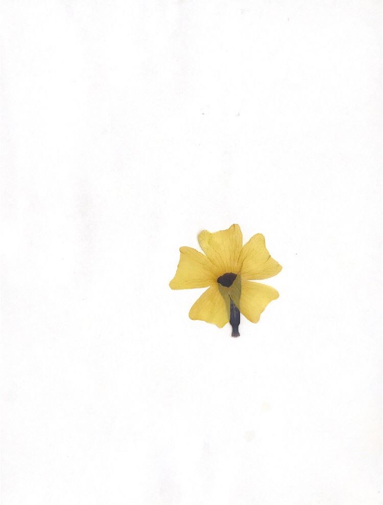
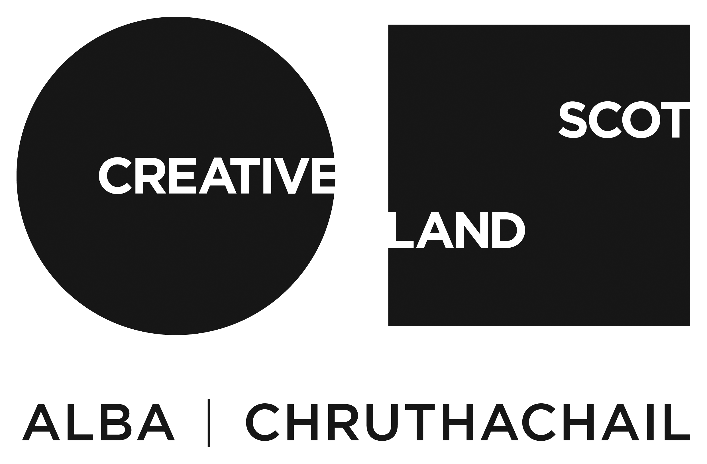

[home](index.md) | [issues](issues.md) | [shop](shop.md)  |  [submissions](submit.md)

## About 

Wet Grain is a magazine for poetry and essays on matters of land-use, provenance, and ownership. It is edited by Patrick Romero McCafferty & Nasim Luczaj.

Its most recent issue, Spring 2026, is [available now](shop.md).

Since 2020, the magazine has included the work of emerging poets alongside a Nobel Prize nominee, & recipients of awards including the Pulitzer, the Forward, a MacArthur Fellowship, the Pushcart Prize, the German Book Prize, the Somerset Maugham, and the Eric Gregory. The magazine was founded in 2020. Past issues have been guested-edited by Sylee Gore (Issue 4), Leo Boix & Nat Teitler FRSL (Issue 5: Latinx).

You can subscribe to our monthly newsletter [here](https://wet-grain-magazine.ghost.io/#/portal/signup/free).  

Our communications manager is Dr. Diana Infante-Vargas.

  

  

​

