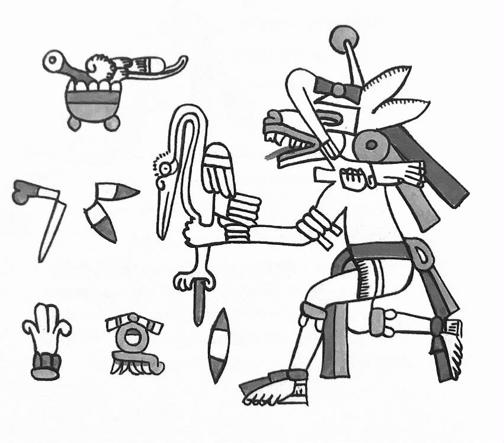

[home](index.md) | [issues](issues.md) | [about](about.md) | [shop](shop.md)  |  [submissions](submit.md)

  <a href="issueeight.html">back to ISSUE EIGHT</a>

 
 

## Editorial  
 

*Nasim*
 
 
The other day, I went into the forest looking for chanterelles. There were
none, not this dry year, though Poland is still so much greener than the
England I’d come from, with its stormless yellow. When I stepped out of
the forest into a clearing, into full noon sunshine, I spotted what I thought
was a dog, basking. Then I saw another, identical, and it dawned on me that
they were wolves. They noticed me, and two or three more came out of the
bushes, as if to plainly inform me of the size of the pack. 
 

I hadn’t realised how affected I’d been by the cursory, stereotypical image
we have of each animal. I’d assumed that a wolf is grey and something you
see in winter. These were largely reddish-brown. They differed from dogs
in the way they perceived me but had no immediate sense of how to react.
I felt much the same. After maybe ten seconds, I turned around, back into
the forest. I took their coming together for a hint to do so, and the whole
situation for a wonderful omen. 
 

But what would it mean to be truly loyal to omens? I know I accept them in a
Pascalian way – it won’t hurt to find an excuse for positive thinking. Not in this
era of foreboding. If they do have more power than I give them credit for, will
these machinations ever avenge themselves on the way we enjoy an extracted
coincidence or a gratuitous pat on the back to push us forward? I don’t know.
I’m open to any scenario. The rational and the esoteric cannot seduce me just by
virtue of being rational or esoteric. As an editor, I am trying to be open to other
kinds of voices than those I shower with reflexive love. Sometimes you see a dog
in a field and discover it’s a wolf. May you, reader, experience some of that, too. 
 
*Patrick*
 
 
I have enrolled in Mexica cosmology school. For a month the small group
has been meeting under a tree down by the graveyard to learn how to read the
script and talk about the layers of astral symbols that make up the calendar. I
joined the class late and still feel totally lost. Every day has its numbered and
oriented symbol, within which there are a myriad further symbols: guardian
god, guardian bird, night guardian. Today for example, 14th August 2026,
is 9-Lizard, its guardian is Huehuecoyotl (Old Coyote), its guardian bird the
turkey and Chalchiuitlicue (She of the Jade Skirts) its night guardian.
Believing creature that I am, what do I do with even a loose grasp of a way
of perceiving that feels distant in language and distant in time, that was
wrecked for silver and gold? On Sunday, the class held a Xochipactli where
we massaged each other with flowers and herbs: basil, spinach, sage, lemon
balm, camomile, mint, and roses. Afterward, the remaining ball of greenery
was placed in the recipient’s navel. The one giving the massage gently found
their heartbeat there, in the centre of the body, with their fist. I don’t know
why this is done but rediscovering someone’s heart undefended like that
stirred me. We’d have smelled of the chinampas through the week had we
not sweated all afternoon in the temazcal praying with a skin drum and
steam. I came out knackered and meek but my imagination, like my body,
had been enlivened. Something of what I had been learning over the weeks
had made its way in. 
 
I’d been told lots of times that the Mexica symbolic order stems from the
accurate and profound observation of the environment and everything in
it. But I only knew it was true when I went to the pyramids of Xochicalco
(Place of the House of Flowers), where the extraordinary images I’d been
looking at in print abounded in the surrounding country. I sat under a
mesquite and thought about what I’d been observing over the months; the
hills of Tepoztlán, the vultures and lizards, the hummingbirds and dogs. It
didn’t matter whether I believed a lizard’s ability to fast meant that those
born on a lizard year would live well-fed lives. Much as the Xochipactli
transformed sentences and depictions into something shared, sensual and
beautiful, the stillness of the ancient site reminded me to trust my own gaze.
It made me want to sit in the grass observing and feeling the implications
of what I observed, inflected with what little recall and thought occurred
proportionally to the immeasurable significance of the place. I looked at
the stellae. I clapped my hands and admired the acoustics. I thought of
the improbability of my being there. I felt a yearning toward a culture so
intent on making colourful, devotional sculpture as a way of communing
harmoniously and rangingly with the butterflies. I wanted to live in such a
culture. 
 
Just living my day with the mischievous Huehuecoyotl watching over
me might also do. By just mentioning him I appreciate two things: that
however I might come by them, all meanings passing through my mind have
a spontaneous power I mostly fail to acknowledge, let alone confront; that
there’s pleasure in the associative dance across meanings these classes have
given me, a pleasure that is completely related to poetry. 
 

​ 

*Representation of Huehuecoyotl, Fejérváry-Mayer Codex*
 
 
It should be obvious that such things also have immediate bearing on
questions of land. How we situate ourselves in our heads is in reciprocity
with buildings, mountains, sun, and horses. So much that we think is
embedded can be renegotiated. It is remarkable just to think that our human
world with its deserts and seas is synchronized by the Gregorian calendar and
GMT, which we take to be neutral. 
 
Selecting work for Wet Grain, it’s tempting to reach for a thesis on greed,
extractivism, and the fight against those who would enrich themselves
further at the expense of others and the world. Indeed, what more concrete
reminders do we need that this fight is at a wretched moment than the
Trump family links to land prospecting in Gaza and Albania? Or of more of
the same profiting from weapons manufacturing within government we saw
in Bush’s cabinet during the invasion of Iraq? In this issue, we offer poems of
protest, poems of political mind, poems of self-enquiry; poems of childhood
play and dreams of flight, lyric and etymological wanderings. Our prose
displays some of the ‘many worlds’ (we hope some of the many remedial and
cohabitant worlds) that humans with their power and imagination imbue
land with. We’re doing our best to present them as the many faces of a
prism. Along with the numinous breath of the corries and the fellow-walker,
Kirsten Norrie notes the fairy link to the Clearances. Yasnaya Elena Gil notes
the huge cultural impact of the Zapatistas, beyond their political efficacy up
to the present day. May the second-sight shed light on land politics. May
the struggle of indigenous land defenders be an example to poets. Differences
propelling us toward a fairer, more vital perception of the beallachs and
cordilleras. 
 

Nasim Luczaj & Patrick Romero McCafferty 
Pietrusza Wola & Tepoztlán
