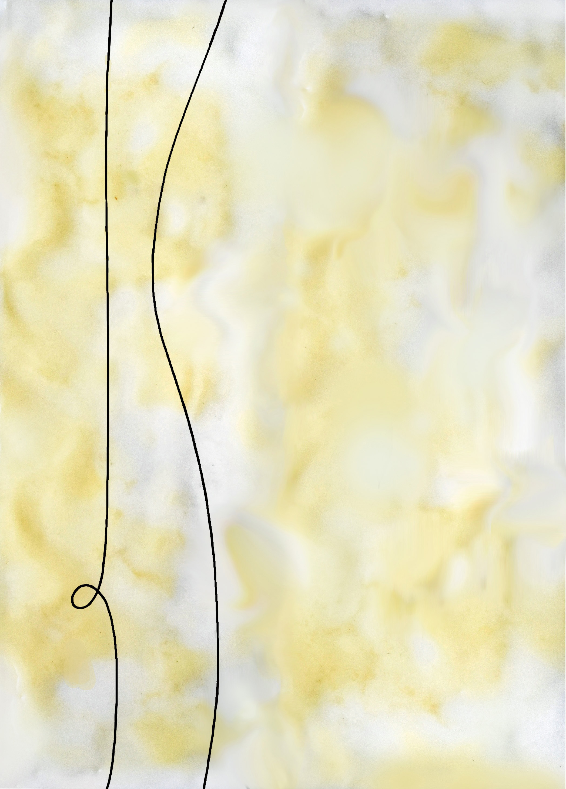

[home](index.md) | [issues](issues.md) | [about](about.md) | [shop](shop.md)  |  [submissions](submit.md)
  
  

# &nbsp;&nbsp;&nbsp;ISSUE EIGHT &nbsp;&nbsp;&nbsp; *AUTUMN 2026*

  
  

  

  
  

## [Editorial](editorial8.md)• ['The Golden Rule' Peter Mackay](thegoldenrule.md) • 'Poetry & Land Politics: A Land-Aware Scottish Ecopoetics' Helena Fornells Nadal • 'in the century of the futuretense' Zoe Friedland • ['a crow is'](acrowis.md), ['no one' CAConrad](noone.md) • 'Memories of work' Ektoras Arkomanis • 'Fallow' Holly Pollard • ['Sited Sight: A Fairyological Tract' Kirsten Norrie](sitedsight.md) • 'origin' Jack Emsden • 'Concorde witnessed from the ground' Jack Westmore • 'Mispronouncing Munch #3' Leo Bussi • 'Glaive' Victoria Spires • ['Stonelore: An Interview with Mathilde Dewavrin' Mathilde Dewavrin & Nasim Luczaj](stonelore.md) • 'Held hale', 'seein da wid' Christie Williamson • 'Half a Century Poem' Nicky Melville • 'Crossing' Eamonn O’Sullivan • ['ON THE SANDWICH PANEL',](onthesandwich.md) ['IN COLD STORAGE' Ida Sieciechowicz (trans. Sarah Luczaj)](incold.md) • ['the word *hope* has no weight, i prefer to say faith',](thewordhope.md) ['i’m going to name this poem burnout is for pussys' lisa minerva luxx](imgoingtocall.md) • ['Who Does Zapatismo Speak to Today?' Yásnaya Elena A. Gil (trans. Ellen Jones)](zapatismo.md) • ['from *American Centuries*' Michaela Coplen](centuries.md) • 'if a', 'what is the word' CAConrad • Notes •  
