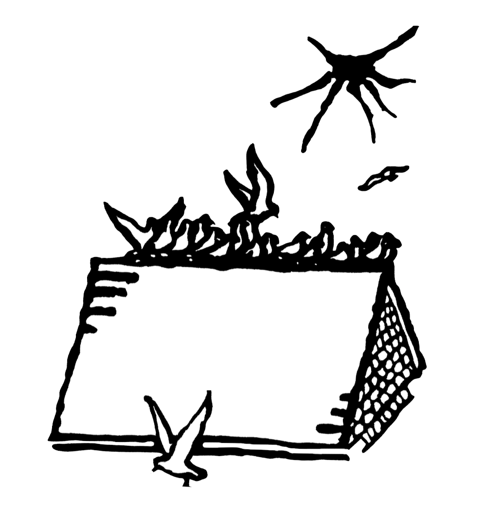

[home](index.md) | [issues](issues.md) | [about](about.md) | [shop](shop.md)  |  [submissions](submit.md)

## Issue Five, Summer 2024, guest-edited by Leo Boix & Nat Teitler

Editorial

#### Poetry

'Shoveling Love & Hate', 'Song for two Shovels', 'Golden Song of Hate & Love', **Emiliano Gomez** / 'Story of the Letter M', 'One day a year', **Juana Adcock** / 'Snow on Venus vs Wisconsin, 1988', **Patrizia Longhitano** / 'Praia do Bonete, Illhabela' **Yessica Klein** / 'The number meme' **Fiorella Terrazas (trans. Leo Boix)** / 'The Water of Dreams' **Flor Bárcenas Feria (trans. Leo Boix)** / 'Still It Won’t Speak' **Adriana Díaz Enciso** / 'The primordial soup' **Daniela Avendaño (trans. Colin Bramwell)** / 'Ode to Gloria Walking Home' **R. Joseph Rodríguez** / 'Cómo brindar por El Ausente' 'Again' **Nathalia Samhil Gonzalez Gutierrez** / 'Fracture in gold' 'Below the Sierra Naica' **Marina Sánchez** / 'Infant Dirge' 'Malcriado' **José Buera** / from 'Three Poetic Modes'**Isabel del Rio** / 'The word' 'The night when I don’t sleep' ['The rooster'](rooster.md) **Hubert Matiúwàa (trans. Juana Adcock)**](rooster.md) / 'Homing' **Guadalupe Villaseñor (trans. Patrick Romero McCafferty)** / 'Hunted', 'Ode to My Lover’s Incisor' **Jacob Anthony Ramírez** / 'O Zaddy' 'e dai, urlo' **Eduardo R. de Siqueira** / 'The Putter-Mike Account' 'A love letter to my ex-psychoanalyst Anouchka Grose, whose outfits I very much enjoyed, and sometimes stopped me from taking my own life, which would make this therapy rather than poetry regardless of how I dress it – there, I said it', **Sim Pereira-Madder** / 

#### Prose

'Translation, Literary Translation and Self-translation' Isabel del Rio / 'Memoria, Justicia, y Verdad: (Self)Translation as Reconciliation' Nathalia Samhil Gonzalez Gutierrez / 'How do we work with and against memory?' Patrizia Longhitano / 'Ni de aquí, Ni de allá: On Writing into the Between' Andres N Ordorica / 'Blood and Soil' Jose Buera / 'On Land' Sim Perreira-Madder / 'Land, Literature, Language' Adriana Diaz Enciso / [Unknotting the String: An Interview with Juana Adcock](prose/interview.md)

​ 

Original artwork by Julia Utreras

