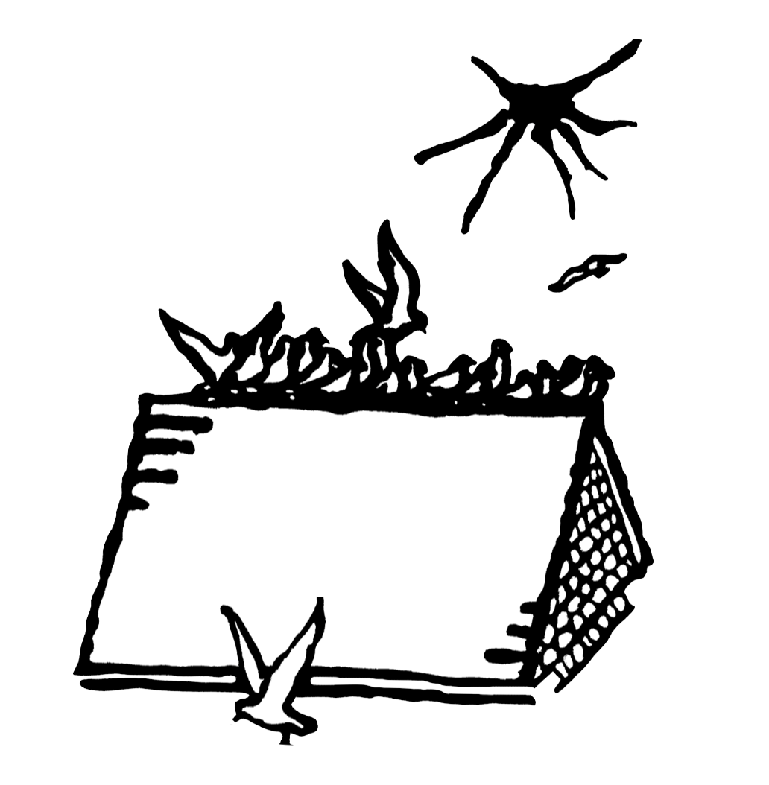

[home](index.md) | [issues](issues.md) | [about](about.md) | [shop](shop.md)  |  [submissions](submit.md)
  
  
# ISSUE FIVE &nbsp;&nbsp;&nbsp;*SUMMER 2024*

  
 

  

  
 

## [Editorial](editorial5.md) 'Shoveling Love & Hate', 'Song for two Shovels', 'Golden Song of Hate & Love', **Emiliano Gomez**  ['Story of the Letter M'](m.md), 'One day a year', **Juana Adcock** &nbsp;&nbsp;&nbsp;&nbsp;&nbsp;&nbsp; 'Snow on Venus vs Wisconsin, 1988', **Patrizia Longhitano** &nbsp;&nbsp;&nbsp;&nbsp;&nbsp;&nbsp; 'Praia do Bonete, Illhabela' **Yessica Klein** &nbsp;&nbsp;&nbsp;&nbsp;&nbsp;&nbsp; 'The number meme' **Fiorella Terrazas (trans. Leo Boix)** &nbsp;&nbsp;&nbsp;&nbsp;&nbsp;&nbsp; 'The Water of Dreams' **Flor Bárcenas Feria (trans. Leo Boix)** &nbsp;&nbsp;&nbsp;&nbsp;&nbsp;&nbsp; 'Still It Won’t Speak' **Adriana Díaz Enciso** &nbsp;&nbsp;&nbsp;&nbsp;&nbsp;&nbsp; 'The primordial soup' **Daniela Avendaño (trans. Colin Bramwell)** &nbsp;&nbsp;&nbsp;&nbsp;&nbsp;&nbsp; 'Ode to Gloria Walking Home' **R. Joseph Rodríguez** &nbsp;&nbsp;&nbsp;&nbsp;&nbsp;&nbsp;'Cómo brindar por El Ausente' 'Again' **Nathalia Samhil Gonzalez Gutierrez** &nbsp;&nbsp;&nbsp;&nbsp;&nbsp;&nbsp; 'Fracture in gold' 'Below the Sierra Naica' **Marina Sánchez** &nbsp;&nbsp;&nbsp;&nbsp;&nbsp;&nbsp; 'Infant Dirge' 'Malcriado' **José Buera** &nbsp;&nbsp;&nbsp;&nbsp;&nbsp;&nbsp; from 'Three Poetic Modes' **Isabel del Rio** &nbsp;&nbsp;&nbsp;&nbsp;&nbsp;&nbsp; 'The word' 'The night when I don’t sleep' [**Hubert Matiúwàa (trans. Juana Adcock)**](rooster.md) &nbsp;&nbsp;&nbsp;&nbsp;&nbsp;&nbsp; 'Homing' **Guadalupe Villaseñor (trans. Patrick Romero McCafferty)** &nbsp;&nbsp;&nbsp;&nbsp;&nbsp;&nbsp; 'Hunted', 'Ode to My Lover’s Incisor' **Jacob Anthony Ramírez** &nbsp;&nbsp;&nbsp;&nbsp;&nbsp;&nbsp; 'O Zaddy' 'e dai, urlo' **Eduardo R. de Siqueira** &nbsp;&nbsp;&nbsp;&nbsp;&nbsp;&nbsp; 'The Putter-Mike Account' ['A love letter to my ex-psychoanalyst Anouchka Grose, whose outfits I very much enjoyed, and sometimes stopped me from taking my own life, which would make this therapy rather than poetry regardless of how I dress it – there, I said it', **Sim Pereira-Madder**](aloveletter.md) &nbsp;&nbsp;&nbsp;&nbsp;&nbsp;&nbsp; 'Translation, Literary Translation and Self-translation' **Isabel del Rio** &nbsp;&nbsp;&nbsp;&nbsp;&nbsp;&nbsp; 'Memoria, Justicia, y Verdad: (Self)Translation as Reconciliation' **Nathalia Samhil Gonzalez Gutierrez** &nbsp;&nbsp;&nbsp;&nbsp;&nbsp;&nbsp; 'How do we work with and against memory?' **Patrizia Longhitano** &nbsp;&nbsp;&nbsp;&nbsp;&nbsp;&nbsp; 'Ni de aquí, Ni de allá: On Writing into the Between' **Andres N Ordorica** &nbsp;&nbsp;&nbsp;&nbsp;&nbsp;&nbsp; 'Blood and Soil' **Jose Buera** &nbsp;&nbsp;&nbsp; 'On Land' **Sim Perreira-Madder** &nbsp;&nbsp;&nbsp;&nbsp;&nbsp;&nbsp; 'Land, Literature, Language' **Adriana Diaz Enciso** &nbsp;&nbsp;&nbsp;&nbsp;&nbsp;&nbsp; [Unknotting the String: An Interview with Juana Adcock](interview.md)

  
   
   
 
