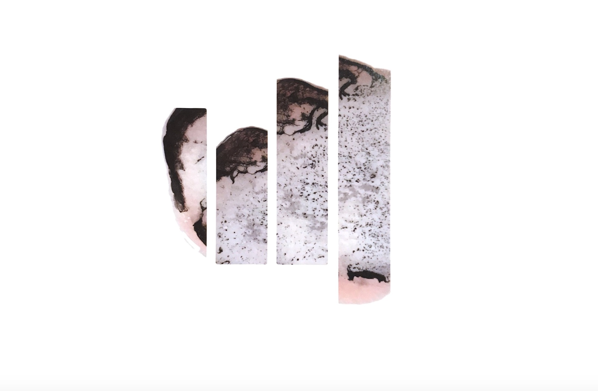

[home](index.md) | [issues](issues.md) | [about](about.md) | [shop](shop.md)  |  [submissions](submit.md)

  
  

# ISSUE FOUR  &nbsp;&nbsp;&nbsp; *SUMMER 2023*

  
  

​ 

  
  

## &nbsp;&nbsp;&nbsp;[Guest Editor's Note](frontmatter.md) &nbsp;&nbsp;&nbsp;&nbsp;&nbsp;&nbsp; [Editorial](editorial4.md) &nbsp;&nbsp;&nbsp;&nbsp;&nbsp;&nbsp;['Open window, liguria' **Madeleine Lamm**](mlamm.md) &nbsp;&nbsp;&nbsp;&nbsp;&nbsp;&nbsp; ['Light Revisions' **Patrick James Errington**](james.md) &nbsp;&nbsp;&nbsp;&nbsp;&nbsp;&nbsp; 'Watermelon', ['Reader, I married him'](baafi.md) **Isabelle Baafi** &nbsp;&nbsp;&nbsp;&nbsp;&nbsp;&nbsp; 'The Hoaders' **Caleb Leow** &nbsp;&nbsp;&nbsp;&nbsp;&nbsp;&nbsp; ['indigitamenta' **Kathleen Heil**](heil.md) &nbsp;&nbsp;&nbsp;&nbsp;&nbsp;&nbsp; ['pitch & glint'](seiler.md), 'gravity', 'Potemkin's village' **Lutz Seiler (trans. Stefan Tobler)** &nbsp;&nbsp;&nbsp;&nbsp;&nbsp;&nbsp; 'There once was a sister-lion' **Heidi Williamson** &nbsp;&nbsp;&nbsp;&nbsp;&nbsp;&nbsp; 'The Garden At Prospect Cottage, 1989' **Sara Larsen** &nbsp;&nbsp;&nbsp;&nbsp;&nbsp;&nbsp; 'On visiting a gallery in snowfall' **Rush Wick** &nbsp;&nbsp;&nbsp;&nbsp;&nbsp;&nbsp; '7,8' **Jed Munson** &nbsp;&nbsp;&nbsp;&nbsp;&nbsp;&nbsp; 'Bow' **Gabriel Levine Brislin** &nbsp;&nbsp;&nbsp;&nbsp;&nbsp;&nbsp; 'Nurture' **Paul Stephenson** &nbsp;&nbsp;&nbsp;&nbsp;&nbsp;&nbsp; 'Route' **Rob A, Mackenzie** &nbsp;&nbsp;&nbsp;&nbsp;&nbsp;&nbsp; 'A Lack of Knowledge' **Agata Maslowska** &nbsp;&nbsp;&nbsp;&nbsp;&nbsp;&nbsp; from 'With Breath' **Alia Zapparova** &nbsp;&nbsp;&nbsp;&nbsp;&nbsp;&nbsp; 'A Warda Song Is Long Enough' **Nur Turkmani** &nbsp;&nbsp;&nbsp;&nbsp;&nbsp;&nbsp; ['a lazy clairvoyant predicts her own future with her phone’s autocomplete' **Laura Theis** &nbsp;&nbsp;&nbsp;&nbsp;&nbsp;&nbsp; 'Meresong' **Laura Varnam**](ltheis.md) &nbsp;&nbsp;&nbsp;&nbsp;&nbsp;&nbsp; ['Before the War' **Cristina Rivera Garza**](war.md) &nbsp;&nbsp;&nbsp;&nbsp;&nbsp;&nbsp; 'Strand' **Laura Davis** &nbsp;&nbsp;&nbsp;&nbsp;&nbsp;&nbsp; 'Green Lights' **Leah Umansky** &nbsp;&nbsp;&nbsp;&nbsp;&nbsp;&nbsp; ['demesne' **Tom Branfoot**](branfoot.md) &nbsp;&nbsp;&nbsp;&nbsp;&nbsp;&nbsp; 'Serving' **S.J. Delaney** &nbsp;&nbsp;&nbsp;&nbsp;&nbsp;&nbsp; 'Print on Wove Paper' **Imogen Reid** &nbsp;&nbsp;&nbsp;&nbsp;&nbsp;&nbsp; 'Rose Water' **Rise** &nbsp;&nbsp;&nbsp;&nbsp;&nbsp;&nbsp; 'Effigy at dusk' **Roshni Gallagher** &nbsp;&nbsp;&nbsp;&nbsp;&nbsp;&nbsp; 'What Survives Us' **Sneha Subramanian Kanta** &nbsp;&nbsp;&nbsp;&nbsp;&nbsp;&nbsp; 'Single' **Lubi Barre** &nbsp;&nbsp;&nbsp;&nbsp;&nbsp;&nbsp; 'Fragments from *A treatise on the influence on the souls of animals*' **Samuel Tongue** &nbsp;&nbsp;&nbsp;&nbsp;&nbsp;&nbsp; 'Liminal' **Jamie Cameron** &nbsp;&nbsp;&nbsp;&nbsp;&nbsp;&nbsp; 'Gull' **Maggie Wang** &nbsp;&nbsp;&nbsp;&nbsp;&nbsp;&nbsp; 'indigitamenta' **Kathleen Heil** &nbsp;&nbsp;&nbsp;&nbsp;&nbsp;&nbsp; 'The Hoarders' **Caleb Leow** &nbsp;&nbsp;&nbsp;&nbsp;&nbsp;&nbsp;

   
​ 

