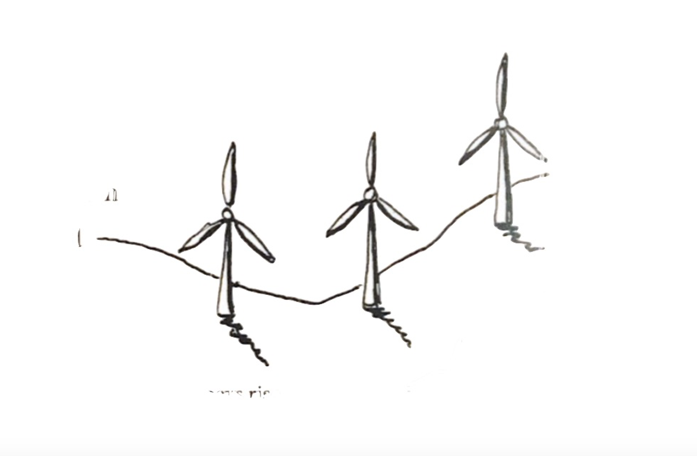

[home](index.md) | [issues](issues.md) | [about](about.md) | [shop](shop.md)  |  [submissions](submit.md)

  
  

# ISSUE ONE &nbsp;&nbsp;&nbsp;&nbsp;&nbsp;&nbsp;&nbsp;&nbsp;&nbsp;&nbsp;&nbsp;&nbsp;&nbsp;&nbsp;&nbsp;&nbsp;&nbsp;&nbsp;&nbsp;&nbsp;&nbsp;&nbsp;&nbsp;&nbsp;&nbsp;&nbsp;&nbsp;&nbsp;&nbsp;&nbsp;&nbsp;&nbsp;&nbsp;&nbsp;&nbsp;&nbsp;&nbsp;&nbsp;&nbsp;&nbsp;&nbsp;&nbsp;&nbsp;&nbsp;&nbsp;&nbsp;&nbsp;&nbsp;&nbsp;&nbsp;&nbsp;&nbsp;&nbsp;&nbsp;&nbsp;&nbsp;&nbsp;&nbsp;&nbsp;&nbsp;&nbsp;&nbsp;&nbsp;&nbsp;&nbsp;&nbsp;&nbsp;&nbsp;&nbsp;&nbsp;&nbsp;&nbsp;&nbsp;&nbsp;&nbsp;&nbsp;&nbsp;&nbsp;&nbsp;&nbsp;&nbsp; *AUTUMN 2020*
## *co-edited with Christian Lemay*
  
  

[Editorial](editorial1.md)

['Daylighting' **Eloise Birtwhistle**](daylighting.md) / ['The whalebone, dreaming' **Mike Farren**](farren.md) / 'Undreamed Light', 'Undressed Light' **Richard Price** / 'Meals' **Julie-ann Rowell** / 'Hamish's Stair' **Shirley Nicholson** / ['White Noise'](whitenoise.md), ['Canal'](canal.md), 'Summer', 'Good Grief', 'Graft' **Elle Heedles** / 'Spying on the fangs of solitude' **Tinashe Mushakavanhu** / 'Personal Archive' **Rupert Loydell** / 'Rear Naked', **Christopher Barkley** / 'Feeling' **Arthur Rimbaud (trans. Angus Reid)** / 'Provenance', 'Muse', 'Among Antiques' **Ken Cockburn** / 'Neolithic Living' **Hamish Swanson** / 'Thresh Winnow Dry' **Aea Varfis-van Warmelo** / ['Velour Legume Serenade'](herd.md) 'Night Plantscape' 'pony cat' **Colin Herd** / ['-erie-'](daly1.md), '-before, between, & after a drink-', ['-adreamandnow-'](daly2.md) **Anthony Daly** / 'Television in Port Talbot' **George Sandifer-Smith** / 'Cockroach' **Jeanne Macdonald** / 'between pints', 'other warrens', 'Gentrify', 'Cat Machine in Budva, Montenegro' **Scott Lilley** / 'These Hands' **Carl Alexandersson** / 'The Return' **Olivia Rafferty** / 'Imagos' **T. Person** / 'Mend' **Martin Breul** / 'A new word for 'hello'' **Giovanna MacKenna** / 'The Eel' **Stephen Wade** / '8' **Sylee Gore** / 'Greet worthy' **Nel Goenas** / 'Pasiphaë in the Park' **Janet Murray** / 'Nigel-no-mates' **Sam Skoog** / 'The Silver Darlings' **David Canning** / 'I wanted so much just to be' **Kirsty Dunlop** 

​ 

  Original artwork by Laura Wade
