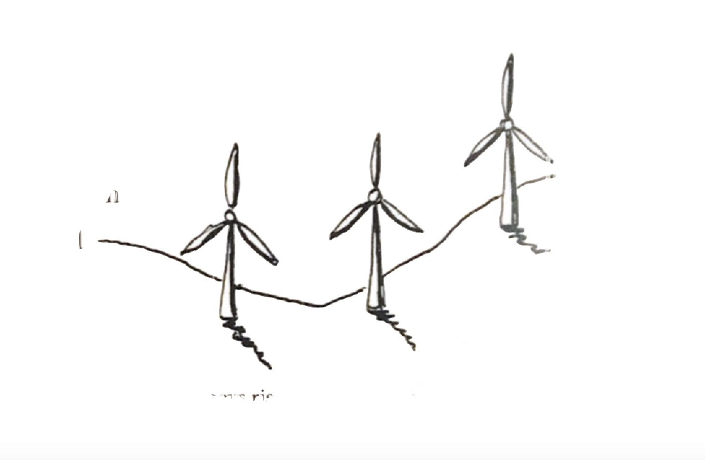

[home](index.md) | [issues](issues.md) | [about](about.md) | [shop](shop.md)  |  [submissions](submit.md)

  
  

# ISSUE ONE &nbsp;&nbsp;&nbsp; *AUTUMN 2020*

  
  

​ 

  
  

## [Editorial](editorial1.md) &nbsp;&nbsp;&nbsp; ['Daylighting' **Eloise Birtwhistle**](daylighting.md) &nbsp;&nbsp;&nbsp; ['The whalebone, dreaming' **Mike Farren**](farren.md) &nbsp;&nbsp;&nbsp; 'Undreamed Light', 'Undressed Light' **Richard Price** &nbsp;&nbsp;&nbsp; 'Meals' **Julie-ann Rowell** &nbsp;&nbsp;&nbsp; 'Hamish's Stair' **Shirley Nicholson** &nbsp;&nbsp;&nbsp; ['White Noise'](whitenoise.md), ['Canal'](canal.md), 'Summer', 'Good Grief', 'Graft' **Elle Heedles** &nbsp;&nbsp;&nbsp; 'Spying on the fangs of solitude' **Tinashe Mushakavanhu** &nbsp;&nbsp;&nbsp; 'Personal Archive' **Rupert Loydell** &nbsp;&nbsp;&nbsp; 'Rear Naked', **Christopher Barkley** &nbsp;&nbsp;&nbsp; 'Feeling' **Arthur Rimbaud (trans. Angus Reid)** &nbsp;&nbsp;&nbsp; 'Provenance', 'Muse', 'Among Antiques' **Ken Cockburn** &nbsp;&nbsp;&nbsp; 'Neolithic Living' **Hamish Swanson** &nbsp;&nbsp;&nbsp; 'Thresh Winnow Dry' **Aea Varfis-van Warmelo** &nbsp;&nbsp;&nbsp; ['Velour Legume Serenade'](herd.md) 'Night Plantscape' 'pony cat' **Colin Herd** &nbsp;&nbsp;&nbsp; ['-erie-'](daly1.md), '-before, between, & after a drink-', ['-adreamandnow-'](daly2.md) **Anthony Daly** &nbsp;&nbsp;&nbsp; 'Television in Port Talbot' **George Sandifer-Smith** &nbsp;&nbsp;&nbsp; 'Cockroach' **Jeanne Macdonald** &nbsp;&nbsp;&nbsp; 'between pints', 'other warrens', 'Gentrify', 'Cat Machine in Budva, Montenegro' **Scott Lilley** &nbsp;&nbsp;&nbsp; 'These Hands' **Carl Alexandersson** &nbsp;&nbsp;&nbsp; 'The Return' **Olivia Rafferty** &nbsp;&nbsp;&nbsp; 'Imagos' **T. Person** &nbsp;&nbsp;&nbsp; 'Mend' **Martin Breul** &nbsp;&nbsp;&nbsp; 'A new word for 'hello'' **Giovanna MacKenna** &nbsp;&nbsp;&nbsp; 'The Eel' **Stephen Wade** &nbsp;&nbsp;&nbsp; '8' **Sylee Gore** &nbsp;&nbsp;&nbsp; 'Greet worthy' **Nel Goenas** &nbsp;&nbsp;&nbsp; 'Pasiphaë in the Park' **Janet Murray** &nbsp;&nbsp;&nbsp; 'Nigel-no-mates' **Sam Skoog** &nbsp;&nbsp;&nbsp; 'The Silver Darlings' **David Canning** &nbsp;&nbsp;&nbsp; 'I wanted so much just to be' **Kirsty Dunlop** 

 
 

 

  Original artwork by Laura Wade
