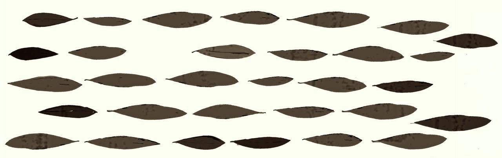

[home](index.md) | [issues](issues.md) | [about](about.md) | [shop](shop.md)  |  [submissions](submit.md)
  
  
# ISSUE SEVEN &nbsp;&nbsp;&nbsp;&nbsp;&nbsp;&nbsp;&nbsp;&nbsp;&nbsp;&nbsp;&nbsp;&nbsp;&nbsp;&nbsp;&nbsp;&nbsp;&nbsp;&nbsp;&nbsp;&nbsp;&nbsp;&nbsp;&nbsp;&nbsp;&nbsp;&nbsp;&nbsp;&nbsp;&nbsp;&nbsp;&nbsp;&nbsp;&nbsp;&nbsp;&nbsp;&nbsp;&nbsp;&nbsp;&nbsp;&nbsp;&nbsp;&nbsp;&nbsp;&nbsp;&nbsp;&nbsp;&nbsp;&nbsp;&nbsp;&nbsp;*SPRING 2026*

 
 

## Editorial
 
 

## Poetry

 

'Enter Grass', 'Enter Imagination' **Dalia Taha (trans. Sara Elkamel** / 'After John Christie's Letters to John Berger (2012) **Jacob Burgess Rollo** / 'Exhibition', 'The Object', **Kevin Cormack** / 'Today', **Helen Calcutt** / from *A Hare's Heat*, **Stanisław Kalina Jaglarz (trans. Scotia Gilroy) / 'Arc', **Rupa Latif Rupa** / 'The Well', **M. Scott Elizabeth** / 'Land side', **Eliza O'Toole** / 'Mona Kareem II', 'Speed Bump', **Mona Kareem (trans. Sara Elkamel** / 'Human Geography', **Meredith MacLeod Davidson** / 'A Sickle Mooon for Joe Luna', **Dom Hale** / 'Saxifraga', **Lucy Lovell** / 'A Move of Even A Single Second Should Be Taken As an Indication', **Taylor Strickland** / 'Biennale', **Emily Fielding** / 'Life Drawing I', **Iona Lee** / 'Greenlandic bread for the tropics', **Elżbieta Wójcik-Leese** / 'I Refuse To Name My Character', **Jinling Wu** / 'Mantle Music', **David Ross Linklater** / 'Rambling Poem', **Jacob James Hurley** / 'Elgol Self-Catering', **William Wyld** 
 
 

## Prose

 

'The Quernstones of Loch nam Bràithntean', **Alec Finlay** / 'Stays', **Patrick Romero McCafferty & Nasim Luczaj** / 'Empedocles Syndrome', **George Finlay Ramsay** / 'ways of swimming on dry land', **ariel rosé**

 

  

 
Original artwork by Astra Papachristodoulou 
