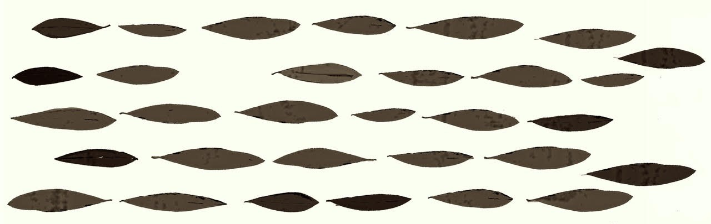

[home](index.md) | [issues](issues.md) | [about](about.md) | [shop](shop.md)  |  [submissions](submit.md)
  
  

# &nbsp;&nbsp;&nbsp;ISSUE SEVEN &nbsp;&nbsp;&nbsp; *SPRING 2026*

## &nbsp;&nbsp;&nbsp;&nbsp;'Enter Grass', 'Enter Imagination' Dalia Taha (trans. Sara Elkamel) &nbsp;&nbsp;&nbsp;&nbsp;&nbsp;&nbsp;&nbsp;&nbsp;&nbsp;&nbsp;&nbsp;&nbsp;  'After John Christie's Letters to John Berger (2012)' **Jacob Burgess Rollo** &nbsp;&nbsp;&nbsp;&nbsp;&nbsp;&nbsp;&nbsp;&nbsp;&nbsp;&nbsp;&nbsp;&nbsp; ['Exhibition',](exhibition.md) ['The Object', **Kevin Cormack**](theobject.md) &nbsp;&nbsp;&nbsp;&nbsp;&nbsp;&nbsp;&nbsp;&nbsp;&nbsp;&nbsp;&nbsp;&nbsp; 'Today', **Helen Calcutt** &nbsp;&nbsp;&nbsp;&nbsp;&nbsp;&nbsp;&nbsp;&nbsp;&nbsp;&nbsp;&nbsp;&nbsp; from *A Hare's Heat*, **Stanisław Kalina Jaglarz (trans. Scotia Gilroy)** &nbsp;&nbsp;&nbsp;&nbsp;&nbsp;&nbsp;&nbsp;&nbsp;&nbsp;&nbsp;&nbsp;&nbsp; 'Arc', **Rupa Latif Rupa** &nbsp;&nbsp;&nbsp;&nbsp;&nbsp;&nbsp;&nbsp;&nbsp;&nbsp;&nbsp;&nbsp;&nbsp; 'The Well', **M. Scott Elizabeth** &nbsp;&nbsp;&nbsp;&nbsp;&nbsp;&nbsp;&nbsp;&nbsp;&nbsp;&nbsp;&nbsp;&nbsp; 'Land side', **Eliza O'Toole** &nbsp;&nbsp;&nbsp;&nbsp;&nbsp;&nbsp;&nbsp;&nbsp;&nbsp;&nbsp;&nbsp;&nbsp; 'Mona Kareem II', 'Speed Bump', **Mona Kareem (trans. Sara Elkamel)** &nbsp;&nbsp;&nbsp;&nbsp;&nbsp;&nbsp;&nbsp;&nbsp;&nbsp;&nbsp;&nbsp;&nbsp; 'Human Geography', **Meredith MacLeod Davidson** &nbsp;&nbsp;&nbsp;&nbsp;&nbsp;&nbsp;&nbsp;&nbsp;&nbsp;&nbsp;&nbsp;&nbsp; 'A Sickle Moon for Joe Luna', **Dom Hale** &nbsp;&nbsp;&nbsp;&nbsp;&nbsp;&nbsp;&nbsp;&nbsp;&nbsp;&nbsp;&nbsp;&nbsp; 'Saxifraga', **Lucy Lovell** &nbsp;&nbsp;&nbsp;&nbsp;&nbsp;&nbsp;&nbsp;&nbsp;&nbsp;&nbsp;&nbsp;&nbsp; ['A Move of Even A Single Second Should Be Taken As an Indication', **Taylor Strickland**](strickland.md) &nbsp;&nbsp;&nbsp;&nbsp;&nbsp;&nbsp;&nbsp;&nbsp;&nbsp;&nbsp;&nbsp;&nbsp; 'Biennale', **Emily Fielding** &nbsp;&nbsp;&nbsp;&nbsp;&nbsp;&nbsp;&nbsp;&nbsp;&nbsp;&nbsp;&nbsp;&nbsp; ['Life Drawing I', **Iona Lee**](lifedrawing.md) &nbsp;&nbsp;&nbsp;&nbsp;&nbsp;&nbsp;&nbsp;&nbsp;&nbsp;&nbsp;&nbsp;&nbsp; 'Greenlandic bread for the tropics', **Elżbieta Wójcik-Leese** &nbsp;&nbsp;&nbsp;&nbsp;&nbsp;&nbsp;&nbsp;&nbsp;&nbsp;&nbsp;&nbsp;&nbsp; 'I Refuse To Name My Character', **Jinling Wu** &nbsp;&nbsp;&nbsp;&nbsp;&nbsp;&nbsp;&nbsp;&nbsp;&nbsp;&nbsp;&nbsp;&nbsp; 'Mantle Music', **David Ross Linklater** &nbsp;&nbsp;&nbsp;&nbsp;&nbsp;&nbsp;&nbsp;&nbsp;&nbsp;&nbsp;&nbsp;&nbsp; 'Rambling Poem', **Jacob James Hurley** &nbsp;&nbsp;&nbsp;&nbsp;&nbsp;&nbsp;&nbsp;&nbsp;&nbsp;&nbsp;&nbsp;&nbsp; ['Elgol Self-Catering', **William Wyld**](elgol.md)
 
 
 

## 'The Quernstones of Loch nam Bràithntean', **Alec Finlay**   
['Stays', **Patrick Romero McCafferty & Nasim Luczaj**](stays.md)  
'Empedocles Syndrome', **George Finlay Ramsay**   
'ways of swimming on dry land', **ariel rosé**  

 

  

 
Original artwork by Astra Papachristodoulou 
