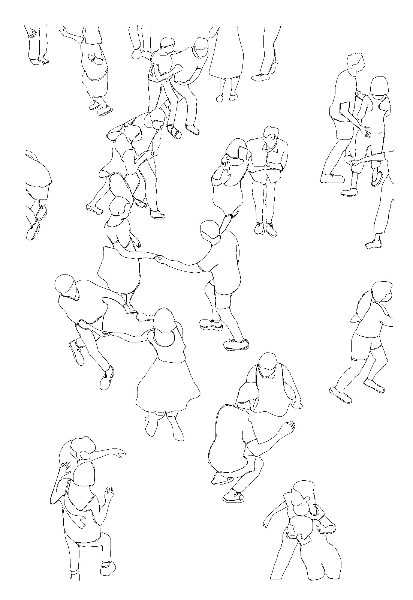

[home](index.md) | [issues](issues.md) | [about](about.md) | [shop](shop.md)  |  [submissions](submit.md)
  
  
# ISSUE SIX  &nbsp;&nbsp;&nbsp;&nbsp;&nbsp;&nbsp;&nbsp;&nbsp;&nbsp;&nbsp;&nbsp;&nbsp;&nbsp;&nbsp;&nbsp;&nbsp;&nbsp;&nbsp;&nbsp;&nbsp;&nbsp;&nbsp;&nbsp;&nbsp;&nbsp;&nbsp;&nbsp;&nbsp;&nbsp;&nbsp;&nbsp;&nbsp;&nbsp;&nbsp;&nbsp;&nbsp;&nbsp;&nbsp;&nbsp;&nbsp;&nbsp;&nbsp;&nbsp;&nbsp;&nbsp;&nbsp;&nbsp;&nbsp;&nbsp;&nbsp;&nbsp;&nbsp;&nbsp;&nbsp;&nbsp;&nbsp;&nbsp;&nbsp;&nbsp;&nbsp;&nbsp;&nbsp;&nbsp;&nbsp;&nbsp;&nbsp;&nbsp;&nbsp;&nbsp;&nbsp;&nbsp;&nbsp;&nbsp;&nbsp;&nbsp;&nbsp;&nbsp;&nbsp;&nbsp;&nbsp;&nbsp; *AUTUMN 2025*
## *Guest-edited by Charles Lang, Eloise Birtwhistle, & Nasim Luczaj*

 

### [Editorial](editorial6.md)

 

### Poetry
  

['Nocturne as Running White Deer'](zak2.md) ['When This Night Comes' **Nidhi Zak/Aria Eipe**](zak.md) / ['The Conductor' **Yasmine Seale**](seale.md) / ['Sunny side'](power2.md) ['dogworld' **Dan Power**](power.md) / ['Seasonal plots (IV)'](lebda.md), ['Seasonal plots (V)' **Małgorzata Lebda (trans. Mira Rosenthal)**](lebda2.md) / ['Birthdays' **Medha Singh**](medha.md) / ['Wildflower' **Ingrid Bringas (trans. Don Cellini)**](bringas.md) / ['Whirl Piece' **Maria Sledmere**](sledmere.md) / ['Something about foxes' **Clara-Læïla Laudette**](clara.md) / ['Speculation on Historical Materialism' **Dipanjali Roy**](roy.md) / ['Xi’ñũ dón don'](hubert6ii.md), ['The boy' **Hubert Matiúwàa (trans. Juana Adcock)**](hubert6.md) / ['Pink purslane' **Kim Crowder**](crowder.md) / ['Mausoleum'](mausoleum.md), ['Red Admirals' **John Glenday**](glenday.md) / ['The View from the Cul de Sac' **Catherine Wilson Garry**](garry.md) / ['The woman who turned to dust in the frost' **Heidi Williamson**](heidi.md) / ['catch' **Christie Williamson**](catch.md) / ['Inchkeith Hypothesis' **Samuel Tongue**](tongue.md) / ['Summer' **gentian rhosa**](rhosa.md) /  
 
### Prose 
  

[Notes on the Poems by Contributors](notes6.md) / [A Living Archive: An interview with Esraa Husain on centring underrepresented voices in Scottish poetry](esraa.md) / [Caring for the Word: An interview with Hubert Matiúwàa](hubertinterview.md) / [The Vocal Presence: An interview with Ellen Renton and Colin Bramwell on process, performance and collaboration](interviewrenton.md) / [Review: Symmetric of Bone, Troy Cabida and (In)Habit, Hetty Cliss - Clara-Læïla Laudette](cliss.md) /

​ 

​ 
