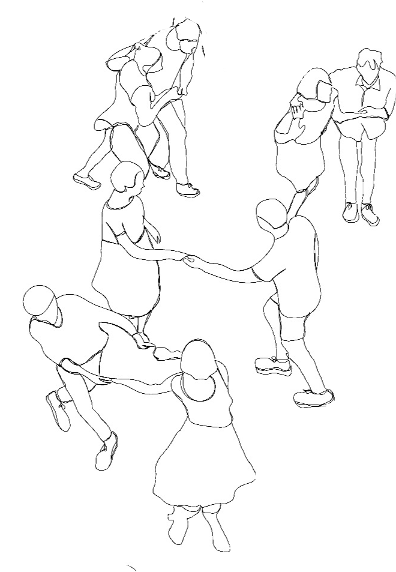

[home](index.md) | [issues](issues.md) | [about](about.md) | [shop](shop.md)  |  [submissions](submit.md)
  
  
# ISSUE SIX  &nbsp;&nbsp;&nbsp;&nbsp; *AUTUMN 2025*

 

## &nbsp;&nbsp;&nbsp;&nbsp; [Editorial](editorial6.md) &nbsp;&nbsp;&nbsp;&nbsp;&nbsp;&nbsp; ['Nocturne as Running White Deer'](zak2.md) ['When This Night Comes' **Nidhi Zak/Aria Eipe**](zak.md) &nbsp;&nbsp;&nbsp;&nbsp;&nbsp;&nbsp; ['The Conductor' **Yasmine Seale**](seale.md) &nbsp;&nbsp;&nbsp;&nbsp;&nbsp;&nbsp;['Sunny side'](power2.md) ['dogworld' **Dan Power**](power.md) &nbsp;&nbsp;&nbsp;&nbsp;&nbsp;&nbsp; ['Seasonal plots (IV)'](lebda.md), ['Seasonal plots (V)' **Małgorzata Lebda (trans. Mira Rosenthal)**](lebda2.md) &nbsp;&nbsp;&nbsp;&nbsp;&nbsp;&nbsp; ['Birthdays' **Medha Singh**](medha.md) &nbsp;&nbsp;&nbsp;&nbsp;&nbsp;&nbsp; ['Wildflower' **Ingrid Bringas (trans. Don Cellini)**](bringas.md) &nbsp;&nbsp;&nbsp;&nbsp;&nbsp;&nbsp; ['Whirl Piece' **Maria Sledmere**](sledmere.md) &nbsp;&nbsp;&nbsp;&nbsp;&nbsp;&nbsp; ['Something about foxes' **Clara-Læïla Laudette**](clara.md) &nbsp;&nbsp;&nbsp;&nbsp;&nbsp;&nbsp; ['Speculation on Historical Materialism' **Dipanjali Roy**](roy.md) &nbsp;&nbsp;&nbsp;&nbsp;&nbsp;&nbsp; ['Xi’ñũ dón don'](hubert6ii.md), ['The boy' **Hubert Matiúwàa (trans. Juana Adcock)**](hubert6.md) &nbsp;&nbsp;&nbsp;&nbsp;&nbsp;&nbsp; ['Pink purslane' **Kim Crowder**](crowder.md) &nbsp;&nbsp;&nbsp;&nbsp;&nbsp;&nbsp; 

​ 

## ['Mausoleum'](mausoleum.md), ['Red Admirals' **John Glenday**](glenday.md) &nbsp;&nbsp;&nbsp;&nbsp;&nbsp;&nbsp; ['The View from the Cul de Sac' **Catherine Wilson Garry**](garry.md) &nbsp;&nbsp;&nbsp;&nbsp;&nbsp;&nbsp; ['The woman who turned to dust in the frost' **Heidi Williamson**](heidi.md) &nbsp;&nbsp;&nbsp;&nbsp;&nbsp;&nbsp; ['catch' **Christie Williamson**](catch.md) &nbsp;&nbsp;&nbsp;&nbsp;&nbsp;&nbsp; ['Inchkeith Hypothesis' **Samuel Tongue**](tongue.md) &nbsp;&nbsp;&nbsp;&nbsp;&nbsp;&nbsp; ['Summer' **gentian rhosa**](rhosa.md)  [Notes on the Poems by Contributors](notes6.md) &nbsp;&nbsp;&nbsp;&nbsp;&nbsp;&nbsp; [A Living Archive: An interview with Esraa Husain on centring underrepresented voices in Scottish poetry](esraa.md) &nbsp;&nbsp;&nbsp;&nbsp;&nbsp;&nbsp; [Caring for the Word: An interview with Hubert Matiúwàa](hubertinterview.md) &nbsp;&nbsp;&nbsp;&nbsp;&nbsp;&nbsp; [The Vocal Presence: An interview with Ellen Renton and Colin Bramwell on process, performance and collaboration](interviewrenton.md) &nbsp;&nbsp;&nbsp;&nbsp;&nbsp;&nbsp; [Review: Symmetric of Bone, Troy Cabida and (In)Habit, Hetty Cliss - Clara-Læïla Laudette](cliss.md) 
