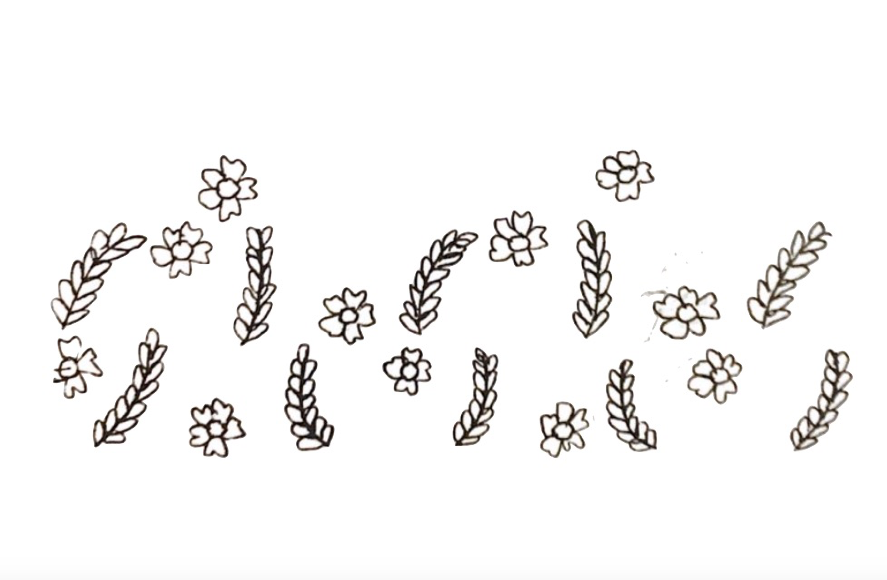

[home](index.md) | [issues](issues.md) | [about](about.md)  |  [shop](shop.md)  |  [submit](submit.md)

  
  

# ISSUE THREE • Summer 2022
## *guest-edited by Nasim Luczaj*
  
  

[Editorial](editorial3.md)  
 
[‘The Future Has To Be Shoved Out The ‘Way So We Can Get Past’ **Tessa Berring**](berring.md) / ‘Field Language’ **David Ross Linklater** / ‘Hogtenburg‘ **Bob Beagrie** / ‘Ode To My Father’s Dancing Name’ **John Chinaka Onyeche** / ‘Hairst blinks’ **Lynn Valentine** / ‘New Shoes’, [Tír na Coille Cailleannaich’](poems/clang.md) **Charles Lang** / ‘The Outlook’ **M.J. Griffin** / [‘One Tree Hill’ **Ellen Renton**](renton.md) / ‘Inventories’, ’There’s Still the Fruit’ **Carine Topal** / hemorrhaging and oystering me onto the open road’ **Brian Jacobs** / ‘Untitled’ **Silas Curtis** / ‘Learning to Drink Seawater, Ludaig’, ‘The Return Home’ **Niall Campbell** / *from* ‘Reign of Embers’, **Cecilia Woloch** / ‘Parliament Parkour’ **Alan Spence** / ‘December 23 (Tătăraşi)’, ‘Dalmeny Street’ **Jeremy Allan Hawkins** / ‘Cuttings’ **Eloise Birtwhistle** / ‘Quaestio — seminar 18/10/21’ **Cecily Fasham** / ‘On going to Anguilla to bury my Grandad’ **Desree** / ‘relume’ **Hannah George** / ‘My Friend Had This Box’ **Tim Tim Cheng** / ‘Berlin Version’ **Ken Cockburn** / ‘rukweza farmer’  **Tawona Sithole** /

​ 

Original artwork by Rosie Watt

