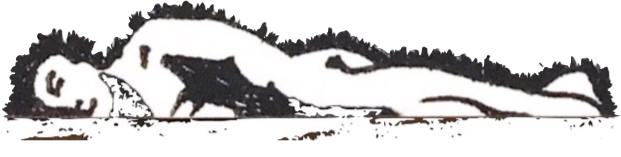

[home](index.md) | [issues](issues.md) | [about](about.md) | [shop](shop.md)  |  [submissions](submit.md)
  
  

# ISSUE TWO &nbsp;&nbsp;&nbsp;*SUMMER 2021*

  

## [Editorial](editorial2.md) 'Green Eyes' **River Ellen MacAskill** &nbsp;&nbsp;&nbsp; 'Angle Shades in Winter' **Michael W. Thomas** &nbsp;&nbsp;&nbsp; '마니또 (Manitto)', '색깔 많은 메아리 (colourful echo)' **Natalie Chunmin Fong** &nbsp;&nbsp;&nbsp; 'St Inan', 'Island Storm' **Liam Welsh** &nbsp;&nbsp;&nbsp; 'Say', 'Wishlist', ['Ajar'](ajar.md), 'Break' **Nasim Luczaj** &nbsp;&nbsp;&nbsp; 'two paths' **Alec Finlay** &nbsp;&nbsp;&nbsp; ['Birch Wintering' **Robin Leiper**](leiper.md) &nbsp;&nbsp;&nbsp; 'The Pentcaitland Hoopoe' **Stella Hervey Birrell** &nbsp;&nbsp;&nbsp; 'Dummler’s', 'Back to School', 'Café de Trollekelder' **Richie McCaffery** &nbsp;&nbsp;&nbsp; 'Muse' **Caroline Maldonaldo** &nbsp;&nbsp;&nbsp; 'Blindsided' **Davinia Hamilton** &nbsp;&nbsp;&nbsp; 'Vanishing Upon Vanishing' **Arthur Allen** &nbsp;&nbsp;&nbsp; ‘I knew it was you stealing fat balls’, 'The Moose Hunt, that', 'words' **Josh Smyth** &nbsp;&nbsp;&nbsp; 'A Satyr in Translation' **Jack Bigglestone** &nbsp;&nbsp;&nbsp; 'Paddock Calls' **Joseph Minden** &nbsp;&nbsp;&nbsp; 'Skipper' **Shane Johnstone** &nbsp;&nbsp;&nbsp; 'New York State Memory', 'Fellow Traveller' **Deborah Tyler-Bennett** &nbsp;&nbsp;&nbsp; 'queer loops' **Alice Hill-Woods** &nbsp;&nbsp;&nbsp; 'Fernworthy Reservoir', 'Cologne is Meshed for a Billionth of a Second', 'Tumescent' **Scott Lilley** &nbsp;&nbsp;&nbsp; 'Aisling / Angel' **Alice Lannon** &nbsp;&nbsp;&nbsp; 'After School, December' **Morag Smith** &nbsp;&nbsp;&nbsp; 'Wargaming' **Samuel Skoog** &nbsp;&nbsp;&nbsp; 'Questions and kite' **Edgar M. Caamano** &nbsp;&nbsp;&nbsp; ['There Are Multiple Photos of Hermit Crabs with Doll Heads for Shells' **Allie Kerper**](kerper.md) &nbsp;&nbsp;&nbsp; 'Prairie Oyster Sonnet', 'Evangeline', 'Golden Delicious' **Maria Sledmere** &nbsp;&nbsp;&nbsp; ['The Old Woman Who Changed Herself into a Man' **Richard Price**](price.md) &nbsp;&nbsp;&nbsp; 'The Tea Towel' **Owen Gallagher** &nbsp;&nbsp;&nbsp; 'Ruchill Hospital' **Gerry Stewart** &nbsp;&nbsp;&nbsp; 'River Swim' **Louis Norman** &nbsp;&nbsp;&nbsp; ['Q. Let’s talk a bit more about that decision to shift away from organic materials.' **Sylee Gore**](sgore.md)  

 
  

 
Original artwork by Andreas Christodoulidis
