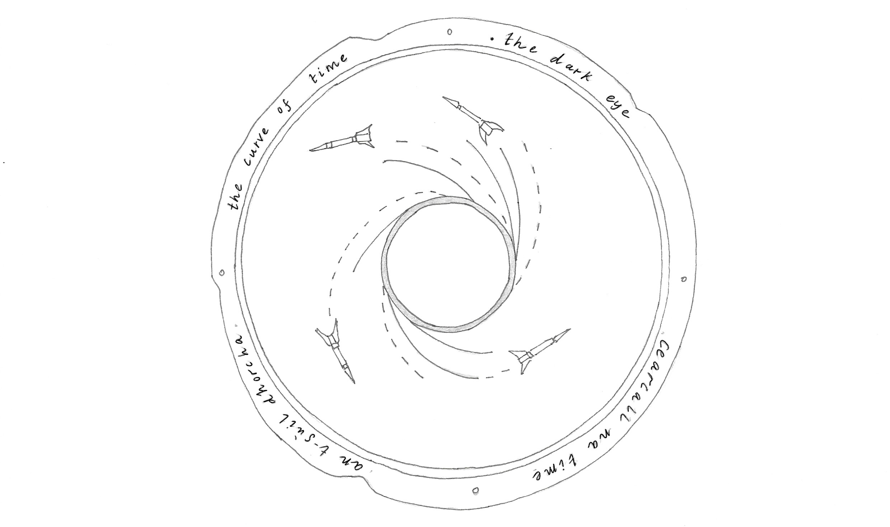
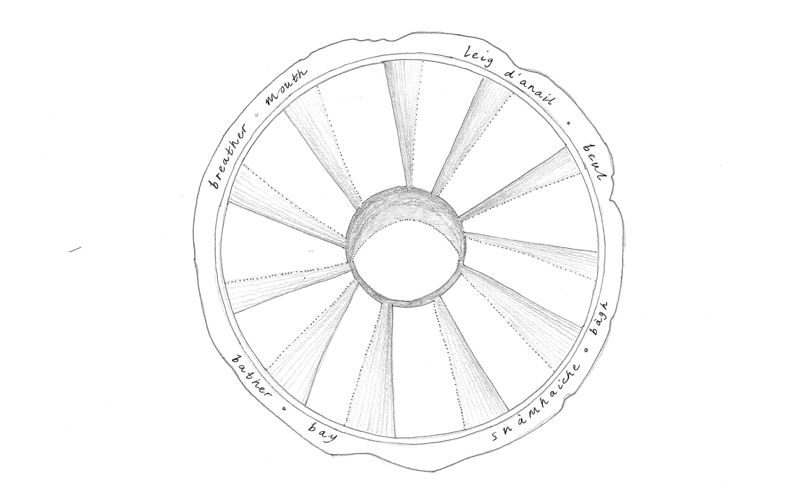
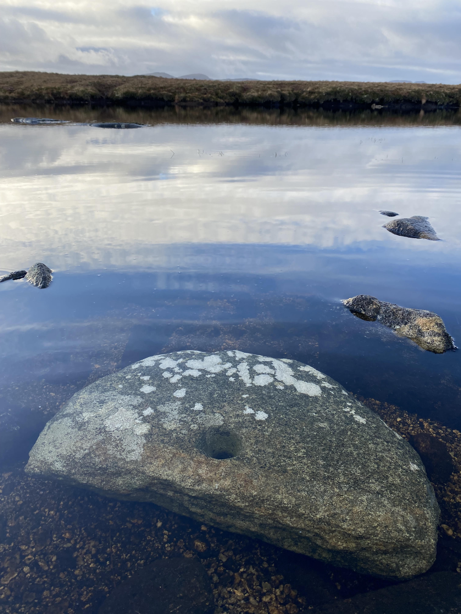
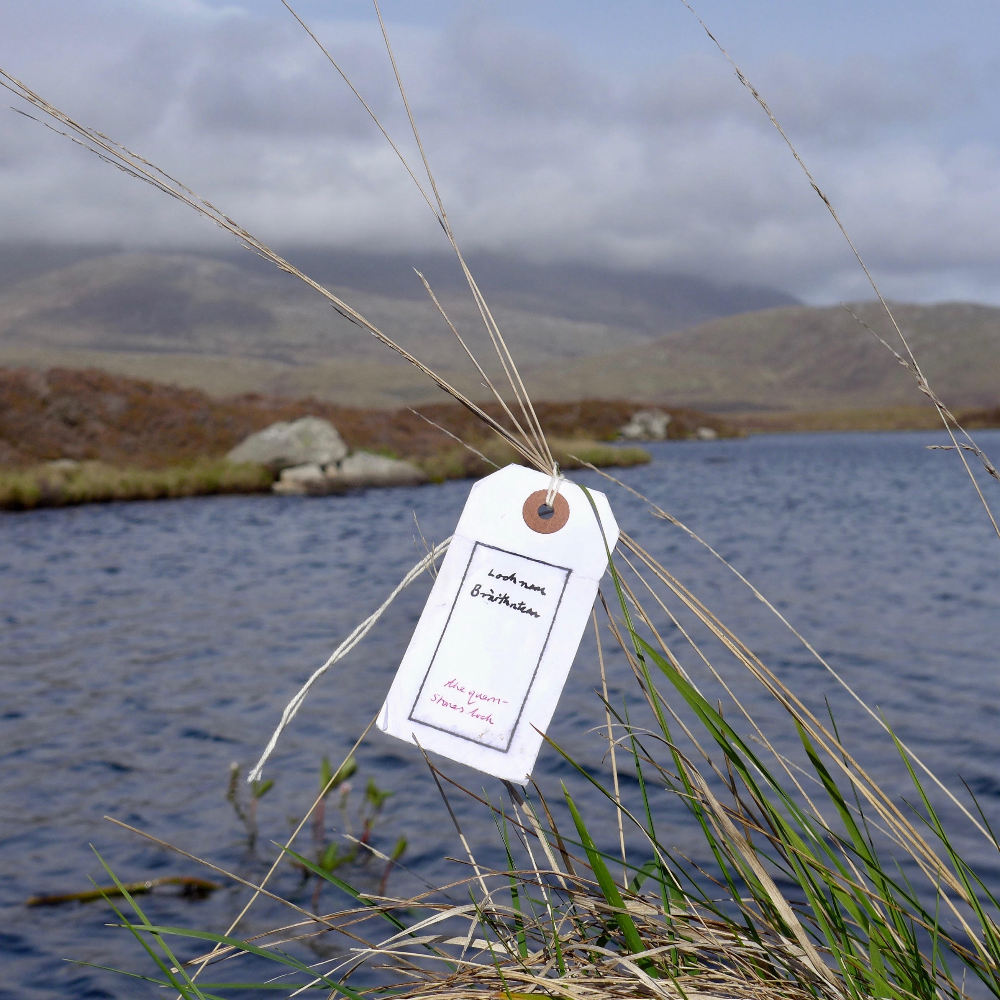

[home](index.md) | [issues](issues.md) | [about](about.md) | [shop](shop.md)  |  [submissions](submit.md)

  <a href="issuesix.html">back to ISSUE SEVEN</a>

 
 

## The Quernstones of Loch nam Bràithntean  
an origin myth for marine renewables   

*Loch nam Bràithntean,* South Uist &nbsp;&nbsp;&nbsp;&nbsp;&nbsp;&nbsp;&nbsp;&nbsp;&nbsp;&nbsp;&nbsp;&nbsp;&nbsp;&nbsp;&nbsp;&nbsp;&nbsp;&nbsp;&nbsp;&nbsp;&nbsp; (NF 760306)  
*Loch na Bràthad,* South Uist &nbsp;&nbsp;&nbsp;&nbsp;&nbsp;&nbsp;&nbsp;&nbsp;&nbsp;&nbsp;&nbsp;&nbsp;&nbsp;&nbsp;&nbsp;&nbsp;&nbsp;&nbsp;&nbsp;&nbsp;&nbsp;&nbsp;&nbsp;&nbsp;&nbsp;&nbsp;&nbsp;&nbsp;&nbsp;&nbsp;&nbsp; (NF 789158)  
*Loch Leum nam Bràdh,* Isle of Skye &nbsp;&nbsp;&nbsp;&nbsp;&nbsp;&nbsp;&nbsp;&nbsp;&nbsp;&nbsp;&nbsp;&nbsp;&nbsp;&nbsp;&nbsp;&nbsp;&nbsp;&nbsp;&nbsp; (NG 469700) 
*Loch Cnoc nan Eun,* North Uist &nbsp;&nbsp;&nbsp;&nbsp;&nbsp;&nbsp;&nbsp;&nbsp;&nbsp;&nbsp;&nbsp;&nbsp;&nbsp;&nbsp;&nbsp;&nbsp;&nbsp;&nbsp;&nbsp;&nbsp;&nbsp;&nbsp;&nbsp;&nbsp;&nbsp;&nbsp;&nbsp;(NF 718714) 
*Loch na Bràthan Mòr and Beag,* Isle of Lewis &nbsp;&nbsp;&nbsp; (NB 389416; 
&nbsp;&nbsp;&nbsp;&nbsp;&nbsp;&nbsp;&nbsp;&nbsp;&nbsp;&nbsp;&nbsp;&nbsp;&nbsp;&nbsp;&nbsp;&nbsp;&nbsp;&nbsp;&nbsp;&nbsp;&nbsp;&nbsp;&nbsp;&nbsp;&nbsp;&nbsp;&nbsp;&nbsp;&nbsp;&nbsp;&nbsp;&nbsp;&nbsp;&nbsp;&nbsp;&nbsp;&nbsp;&nbsp;&nbsp;&nbsp;&nbsp;&nbsp;&nbsp;&nbsp;&nbsp;&nbsp;&nbsp;&nbsp;&nbsp;&nbsp;&nbsp;&nbsp;&nbsp;&nbsp;&nbsp;&nbsp;&nbsp;&nbsp;&nbsp;&nbsp;&nbsp;&nbsp;&nbsp;&nbsp;&nbsp;&nbsp;&nbsp;&nbsp;&nbsp;&nbsp;&nbsp;&nbsp;&nbsp;&nbsp;&nbsp;&nbsp;&nbsp;&nbsp;&nbsp;&nbsp;&nbsp;&nbsp;NB 389414) 
*Slochd nam Bràthan,* Isle of Lewis &nbsp;&nbsp;&nbsp;&nbsp;&nbsp;&nbsp;&nbsp;&nbsp;&nbsp;&nbsp;&nbsp;&nbsp;&nbsp;&nbsp;&nbsp;&nbsp;&nbsp;&nbsp;&nbsp;&nbsp;&nbsp; (c. NB 330212) 
*Cladach Bràthnach,* Port Ruadh, Heisgeir &nbsp;&nbsp;&nbsp;&nbsp;&nbsp;&nbsp;&nbsp;&nbsp; (c. NF 643617) 
*Rubha nam Bràthairean,* Isle of Skye &nbsp;&nbsp;&nbsp;&nbsp;&nbsp;&nbsp;&nbsp;&nbsp;&nbsp;&nbsp;&nbsp;&nbsp;&nbsp;&nbsp;&nbsp;&nbsp;&nbsp; (NG 527628)   

I thought there was only one loch to find, Loch nam Bràithntean, *the querns loch*, a few miles north of Cille Donan, but then, working from old maps and folk memory, I discovered seven more pockled over Na h-Eileanan Siar, *the western isles*, and An t-Eilean Sgitheanach, *isle of skye*. They share the myth of broken querns.   

Andy helped me find Loch nam Bràithntean right where it’s supposed to be, a dark eye among many, blinking across these loch-strewn isles. Just an ordinary water, though the name has the grain of historical memory, and, if we will listen, it speaks to us of energy – where it comes from, how much there is, who owns it, who profits.   

I don’t have much walking in my legs, so I like to sit with names and their meanings. *The querns loch* holds a tale of an ancient technology, the hand-mill, which endured in these isles for two millennia. The water looks too cold to go in. Then the rain comes in sheets; it feels grey, to come so far and find so little – no carved stones peering back from the murk; no archaeologist guddling in the peaty silt for the curve of a quern?   

Màiri NicGillÌosa tells me that Ronald Black recorded a Michaelmas dance in which a young couple would perform *‘an archaic death-and-resurrection drama called Cailleach an Dùdain (the Wife of the Quern-dust)’.* This corn rite is described in Carmichael’s *Carmina Gadelica*. *‘The man had a rod called the slachdan draoidheachd or druidic wand. The words begin:*   

&nbsp;&nbsp;&nbsp;&nbsp;&nbsp;&nbsp;&nbsp; *Cailleach an dùdain, dùdain, dùdain, dùdain*  
&nbsp;&nbsp;&nbsp;&nbsp;&nbsp;&nbsp;&nbsp; *Cailleach an dùdain, cum do dheirreadh rium ...*  
&nbsp;&nbsp;&nbsp;&nbsp;&nbsp;&nbsp;&nbsp; *Cailleach of the quern-dust, quern-dust, quern-dust,*  
&nbsp;&nbsp;&nbsp;&nbsp;&nbsp;&nbsp;&nbsp; *keep your behind to me ...*   

*The pair gesticulate and attitudinise as the man flourished the wand, finally touching her with it so that she drops dead. He dances for grief, then resuscitates her, limb by limb, producing comic results as he blows first on each hand, then on each foot, then into her mouth, with a touch of the wand to her heart. At this her entire body suddenly bursts into life, she springs up, and they dance together for joy.’* [1]   

For seafaring cultures, the motion of the grinding quern was a natural origin myth for the ebb and flow of the sea. In Orkney I unlocked a folk record of tidal energy embedded in place-names, including The Swelkie, *Swirly*, a tidal race off Stroma, where Viking colonists figured the whirlpool was stirred into a boiling rage by the sunken quern of Grótti. [2] This origin myth for the tides was carried from the Moskstraumen, off Lofoten, in a Norse Edda, from where it sailed down to Stroma and on to the Hebrides, where it was naturalised into Gaelic, despite the lack of local whirlpool.  
I found the corresponding tale of sunken quernstones in a story of Aonghas Beag mac Aonghais ’ic Eachainn ’ic Dhòmhnaill ’ic Chaluim ’ic Dhòmhnaill (Angus MacLellan), a tradition bearer from Loch Eynort, best known for *Stories from South Uist*, which John Lorne Campbell transcribed. The islanders ground their corn by hand to avoid the tithe charged by estate mills, until, Aonghas records, lairds ordered *‘everyone who possessed a hand quern should permit it to be smashed... the broken quernstones were then thrown into a loch at Ormacleit which thereafter took the name of the Loch of the Querns’.* [3] This proscription began in the medieval period, following the arrival of larger windmills, and was enforced periodically. I came to Loch nam Bràithntean to reflect on the dispossession of a communal technology, so typical of the exploitation of crofters, and compare the fraught past with today’s wind and wave technology, and the profits from these, which reinforce the ascendancy of lairds, or their contemporary multinational equivalents.  

I call them *the broken flowers*. You can look at Lacasaidh (Laxay), where the tacksman, Coinneach Ban, ordered the clach uachdair, *top stones*, thrown in *the salmon river* where it joins the sea, at Poll Gorm, *the bluey pit*; the precise location is recorded as Slochd nam Bràthan, *the querns slack.*  

On early trips to The Western Isles, I would stop off with Maoilios Caimbeul at his croft in Flodigarry, on Skye. On the walk to the hotel bar we’d glimpsea lochan in the fold of Dunans, dunes. Years later, when I told Maoilios of my quest for querns, he told me its name, Leum nam Bràdh, *leaping querns loch*. The haunting sounds of stones tumbling, splintering, and splashing, were there all the time if I had known to listen. Their destruction was overseen by the factors of Lord MacDonald. The artist Henry Castle took the quern- stone as an emblem of the struggle for crofter’s rights around Staffin. He was shown broken querns, and evidence of a quarry, Rubha nam Bràthairean, *the quernstone point*, where hand-mills were quarried from 500BC until the late 19th century. [4]   

  

I spotted another site on the first edition OS of South Uist, named Loch na Bràthad, near Gàraidh Ur. The last sites I identified are on the Isle of Lewis, in an expanse of moor my legs won’t reach, so Mairi walked to Loch na Bràthan Mòr and Beag, *the wee and big quernstone lochs*, near Gleann Airigh na Faing, *fank shieling glen*.   

After we’d set up the ‘Broken Flowers/Blàthan Briste’ exhibition, at Taigh Chearsabhagh, Kate and I drove to the west side of Uist, to look for another quern loch, as Margaret-Joan MacIsaac told us there were broken quernstones associated with Loch Cnoc nan Eun, *sheeps knock loch*, a boggy field near the mill at Loch Hough, whose wheel supplanted querns but was long fallen into disuse. [5] Then we drove north to visit Fergus, the laird, who let me borrow some wonderful examples of ancient quernstones for the exhibition, which he has pulled from lochs, or found in fields, bogs, or dunes. Fergus had the knack of match-making parts which belonged together, and they were laid out in his garden like cupped hands, alongside bits of driftwood, salvage, and thoughtful shells. I found more in Kildonan Museum, stored in stacks, like crispbread wheels.   

For the exhibition, I invited Hannah Imlach to create a quern-renewable hybrid sculpture, sending her the likeness of a quern which I’d discovered in a marine device, the Open Hydro, along with images of decorated querns. As with many innovative marine devices, it’s already extinct. There is no marine renewable technology being developed on the Western Isles but, in time, some will surely voyage here from the Billia Croo test centre, on Orkney, following the longships around Cape Wrath. [6] Hannah photographed one of the querns in the gallery, giving the grinding stone the appearance of a pupil set in the socket of a reproachful eye. [7]   

  

In folklore, the grinding quern is the fucking of masculine and feminine. The stones were symbols of female power as, in Neolithic culture, women were the millers; the local archaeologist Kate Macdonald told me, each lassie was given a quernstone at puberty and, when her time came, buried with it. [8] The Western Isles is a hyperoceanic environment and, compared to mainland certainties, the islands are transitory presences which swell and shrink with the sea. It rains three days in four; the predominant element is water, everywhere water. Weather and tides define made forms: squalls shape low thick- walled thatched dwellings; waves manifest in the hulls of boats and shapes of sails; winds determine the design of mills. [9] The same environmental forces are influencing the too-late transition from what Pier Paolo Pasolini termed ‘Petrolio’ – the nexus of the carbon burning economy – in an era when the wrongness of our relationship to energy bears down on us. In the renewables industry technological innovation proceeds in a series of speculative leaps. Our foolishly delayed sea-change is returning us to variations of the mill form, a turning force which could redeem our relationship to power. Someday marine devices will populate our offshore in a whirl of energy generation, establishing new sea roads to maintain vast arrays of *windflowers* and *waveflowers*. Someday smashed quernstones and submerged forests will be joined by rusty gear and barnacle-encrusted fixings.   

Compare saddle and rotary querns, which endured into the twentieth century, with imposed technologies, such as of the rocket base and test range on Benbecula and South Uist, which combine the technologies of warfare and weather observation, with no heed for local culture. [10] Will renewables be any different? Islands are wonderful laboratories for trialling engineered technologies in localised environments and weathers, but do we give enough consideration to the third element, *community*. [11] To date, transition in the Western Isles consists of a handful of private and community turbines, although on the Isle of Lewis, at Spiorad na Mara (offshore), and Arnish (onshore), controversial wind energy projects of scale are proposed. [12] Wind is plentiful, but there’s no comparison with the Orkney renewables revolution. I take the broken querns as an argument energy production must not be monopolised by landowners or multinational companies. The ancient conflict between the household quern and the laird’s windmill was a prophecy of the fraught relationship between islanders and imported technology; the smashed *‘flowers’* warn us against a future in which wind and marine renewables are the principal local energy sources, and islands export power, as Orkney does now. The quernstone lochs ask that we reflect how the vast generative capacity of marine energy should be owned and shared. Folk history gives us every reason to question whether devices designed elsewhere will be integrated into native Gaelic culture; whether renewables will evolve into a communal good; or will energy infrastructure be the latest in a long line of extractive industries.   

Broken Flowers is a manifesto for the just distribution of resources. It sketches a utopian vision of the Western Isles, Scotland, or the British Isles, which, hard as it is to imagine, has the fortitude to adapt to energy constraints in a *just* manner. (The politics of the pandemic are not a hopeful example). Ideas and innovations should be held in common; no-one should own the winds, the tides, nor should The Crown Office own the seabed.   

Andy arranged for a boat to ferry us over to Heisgeir (Monach Isles). Weather is as much a part of our history as battles and laws. The unfortunate inhabitants were forerunners of Nuatambu and the other Solomon Islands inundated by rising sea levels, for a great storm deluged Heisgeir in 1721, forcing the *‘wadsetters, tacksmen, and possessors’* of land to send a letter pleading to be removed. [13] After a companionable walk by Cuidhe Ghrianain, *sunnyspot pen*, where hundreds of seals were singing, and Loch nam Buadh, *loch of virtues*, we shared a mackerel picnic. Then, feeling braver because the sea was warmer, I ploutered in the bay until I found the cluster of chisel-marks, like fingernail moons, the remains of Clach Bràthneach, *quernstone quarry*, at Port Ruadh. Here the rock formation produced some of the finest hand- mills in the Western Isles. The work was cold and hard as the quarry could only be worked at low tide. The incomplete incised circles are a warning from the past: a journey which began by a loch of broken querns ended on an island without islanders.

#### &nbsp;&nbsp;&nbsp;&nbsp;&nbsp;&nbsp;&nbsp;&nbsp;&nbsp;&nbsp;&nbsp;&nbsp;&nbsp;&nbsp;&nbsp;&nbsp;&nbsp;&nbsp;&nbsp;&nbsp;&nbsp;&nbsp;&nbsp;&nbsp;&nbsp;&nbsp;&nbsp;&nbsp;&nbsp;&nbsp;&nbsp;&nbsp;&nbsp;&nbsp;&nbsp;&nbsp;&nbsp;&nbsp;&nbsp;&nbsp;&nbsp;&nbsp;&nbsp;&nbsp;&nbsp;&nbsp;&nbsp;&nbsp;&nbsp;&nbsp;&nbsp;&nbsp;&nbsp;&nbsp;&nbsp;&nbsp;&nbsp;&nbsp;&nbsp;&nbsp;&nbsp;&nbsp; Cladach Bràthnach
 
&nbsp;&nbsp;&nbsp;&nbsp;&nbsp;&nbsp;&nbsp;&nbsp;&nbsp;&nbsp;&nbsp;&nbsp;&nbsp;&nbsp;&nbsp;&nbsp;&nbsp;&nbsp;&nbsp;&nbsp;&nbsp;&nbsp;&nbsp;&nbsp;&nbsp;&nbsp;&nbsp;&nbsp;&nbsp;&nbsp;&nbsp;&nbsp;&nbsp;&nbsp;&nbsp;&nbsp;&nbsp;&nbsp;&nbsp;&nbsp;&nbsp;&nbsp;&nbsp;&nbsp;&nbsp;&nbsp;&nbsp;&nbsp;&nbsp;&nbsp;&nbsp;&nbsp;&nbsp;&nbsp;&nbsp;&nbsp;&nbsp;&nbsp;&nbsp;&nbsp;&nbsp;&nbsp;the chisel  
&nbsp;&nbsp;&nbsp;&nbsp;&nbsp;&nbsp;&nbsp;&nbsp;&nbsp;&nbsp;&nbsp;&nbsp;&nbsp;&nbsp;&nbsp;&nbsp;&nbsp;&nbsp;&nbsp;&nbsp;&nbsp;&nbsp;&nbsp;&nbsp;&nbsp;&nbsp;&nbsp;&nbsp;&nbsp;&nbsp;&nbsp;&nbsp;&nbsp;&nbsp;&nbsp;&nbsp;&nbsp;&nbsp;&nbsp;&nbsp;&nbsp;&nbsp;&nbsp;&nbsp;&nbsp;&nbsp;&nbsp;&nbsp;&nbsp;&nbsp;&nbsp;&nbsp;&nbsp;&nbsp;&nbsp;&nbsp;&nbsp;&nbsp;&nbsp;&nbsp;&nbsp;&nbsp;comes  
&nbsp;&nbsp;&nbsp;&nbsp;&nbsp;&nbsp;&nbsp;&nbsp;&nbsp;&nbsp;&nbsp;&nbsp;&nbsp;&nbsp;&nbsp;&nbsp;&nbsp;&nbsp;&nbsp;&nbsp;&nbsp;&nbsp;&nbsp;&nbsp;&nbsp;&nbsp;&nbsp;&nbsp;&nbsp;&nbsp;&nbsp;&nbsp;&nbsp;&nbsp;&nbsp;&nbsp;&nbsp;&nbsp;&nbsp;&nbsp;&nbsp;&nbsp;&nbsp;&nbsp;&nbsp;&nbsp;&nbsp;&nbsp;&nbsp;&nbsp;&nbsp;&nbsp;&nbsp;&nbsp;&nbsp;&nbsp;&nbsp;&nbsp;&nbsp;&nbsp;&nbsp;&nbsp;full circle   

&nbsp;&nbsp;&nbsp;&nbsp;&nbsp;&nbsp;&nbsp;&nbsp;&nbsp;&nbsp;&nbsp;&nbsp;&nbsp;&nbsp;&nbsp;&nbsp;&nbsp;&nbsp;&nbsp;&nbsp;&nbsp;&nbsp;&nbsp;&nbsp;&nbsp;&nbsp;&nbsp;&nbsp;&nbsp;&nbsp;&nbsp;&nbsp;&nbsp;&nbsp;&nbsp;&nbsp;&nbsp;&nbsp;&nbsp;&nbsp;&nbsp;&nbsp;&nbsp;&nbsp;&nbsp;&nbsp;&nbsp;&nbsp;&nbsp;&nbsp;&nbsp;&nbsp;&nbsp;&nbsp;&nbsp;&nbsp;&nbsp;&nbsp;&nbsp;&nbsp;&nbsp;&nbsp;in these  
&nbsp;&nbsp;&nbsp;&nbsp;&nbsp;&nbsp;&nbsp;&nbsp;&nbsp;&nbsp;&nbsp;&nbsp;&nbsp;&nbsp;&nbsp;&nbsp;&nbsp;&nbsp;&nbsp;&nbsp;&nbsp;&nbsp;&nbsp;&nbsp;&nbsp;&nbsp;&nbsp;&nbsp;&nbsp;&nbsp;&nbsp;&nbsp;&nbsp;&nbsp;&nbsp;&nbsp;&nbsp;&nbsp;&nbsp;&nbsp;&nbsp;&nbsp;&nbsp;&nbsp;&nbsp;&nbsp;&nbsp;&nbsp;&nbsp;&nbsp;&nbsp;&nbsp;&nbsp;&nbsp;&nbsp;&nbsp;&nbsp;&nbsp;&nbsp;&nbsp;&nbsp;&nbsp;few  
&nbsp;&nbsp;&nbsp;&nbsp;&nbsp;&nbsp;&nbsp;&nbsp;&nbsp;&nbsp;&nbsp;&nbsp;&nbsp;&nbsp;&nbsp;&nbsp;&nbsp;&nbsp;&nbsp;&nbsp;&nbsp;&nbsp;&nbsp;&nbsp;&nbsp;&nbsp;&nbsp;&nbsp;&nbsp;&nbsp;&nbsp;&nbsp;&nbsp;&nbsp;&nbsp;&nbsp;&nbsp;&nbsp;&nbsp;&nbsp;&nbsp;&nbsp;&nbsp;&nbsp;&nbsp;&nbsp;&nbsp;&nbsp;&nbsp;&nbsp;&nbsp;&nbsp;&nbsp;&nbsp;&nbsp;&nbsp;&nbsp;&nbsp;&nbsp;&nbsp;&nbsp;&nbsp;stone discs  
 
&nbsp;&nbsp;&nbsp;&nbsp;&nbsp;&nbsp;&nbsp;&nbsp;&nbsp;&nbsp;&nbsp;&nbsp;&nbsp;&nbsp;&nbsp;&nbsp;&nbsp;&nbsp;&nbsp;&nbsp;&nbsp;&nbsp;&nbsp;&nbsp;&nbsp;&nbsp;&nbsp;&nbsp;&nbsp;&nbsp;&nbsp;&nbsp;&nbsp;&nbsp;&nbsp;&nbsp;&nbsp;&nbsp;&nbsp;&nbsp;&nbsp;&nbsp;&nbsp;&nbsp;&nbsp;&nbsp;&nbsp;&nbsp;&nbsp;&nbsp;&nbsp;&nbsp;&nbsp;&nbsp;&nbsp;&nbsp;&nbsp;&nbsp;&nbsp;&nbsp;&nbsp;&nbsp;left for the tide  
&nbsp;&nbsp;&nbsp;&nbsp;&nbsp;&nbsp;&nbsp;&nbsp;&nbsp;&nbsp;&nbsp;&nbsp;&nbsp;&nbsp;&nbsp;&nbsp;&nbsp;&nbsp;&nbsp;&nbsp;&nbsp;&nbsp;&nbsp;&nbsp;&nbsp;&nbsp;&nbsp;&nbsp;&nbsp;&nbsp;&nbsp;&nbsp;&nbsp;&nbsp;&nbsp;&nbsp;&nbsp;&nbsp;&nbsp;&nbsp;&nbsp;&nbsp;&nbsp;&nbsp;&nbsp;&nbsp;&nbsp;&nbsp;&nbsp;&nbsp;&nbsp;&nbsp;&nbsp;&nbsp;&nbsp;&nbsp;&nbsp;&nbsp;&nbsp;&nbsp;&nbsp;&nbsp;to grind in-  
&nbsp;&nbsp;&nbsp;&nbsp;&nbsp;&nbsp;&nbsp;&nbsp;&nbsp;&nbsp;&nbsp;&nbsp;&nbsp;&nbsp;&nbsp;&nbsp;&nbsp;&nbsp;&nbsp;&nbsp;&nbsp;&nbsp;&nbsp;&nbsp;&nbsp;&nbsp;&nbsp;&nbsp;&nbsp;&nbsp;&nbsp;&nbsp;&nbsp;&nbsp;&nbsp;&nbsp;&nbsp;&nbsp;&nbsp;&nbsp;&nbsp;&nbsp;&nbsp;&nbsp;&nbsp;&nbsp;&nbsp;&nbsp;&nbsp;&nbsp;&nbsp;&nbsp;&nbsp;&nbsp;&nbsp;&nbsp;&nbsp;&nbsp;&nbsp;&nbsp;&nbsp;&nbsp;to rings   

The two illustrations show decorated querns recovered from the quernstone lochs. Hanna Tuulikki illustrated these fictional objects, responding to my concepts and preparatory sketches, along with original archaeological drawings. The final drawings featured here are by Kate McAllan. The series represents different eras of energy and the technological forms which define them; this pair shows rockets and the blades of an Open Hydro marine device. The poems were translated into Gaelic by Maoilios Caimbeul. *‘the dark eye/the curve of time’; ‘breather/mouth//bather/bay’.*   

The photographs show a quern being returned to a Lewisian loch, Màiri NicGillÌosa (Mairi Gillies), 2023; Clach Bràthnach, Port Ruadh, Heisgeir, Alec Finlay, 2017, and Loch nam Bràithntean, Alec Finlay, 2017.    

  

  

  

  

  

  

Footnotes

[1] Ronald Black: ‘The Day of the Quern-dust’, West Highland Free Press, 25 Sept 1987; [https://www.querndust. co.uk/jpgs/29TheDay.jpg]   
[2] Grótti features in the Norse Edda of Snorri, Skáldskaparmál; I first discuss these myths in minnmouth (2017).   
[3] Mike Parker Pearson, Niall Sharples, Jim Symonds: South Uist: Archaeology and History of a Hebridean Island, Tempus Publishing Ltd, (2004).   
[4] Henry Castle: ‘A Crofters’ Memorial for Staffin’, commissioned by Atlas Arts, 2018; [https://www.henrycastle.com/ crofter-memorial.] Rubha nam Bràthairean is sometimes translated the brother’s point.   
[5] ‘Blàthan Briste/Broken Flowers’, conceived by Alec Finlay for Taigh Chearsabhagh, Lochmaddy, North Uist, Monday 7 August – Saturday 28 October 2017, with contributions from Hannah Imlach, Hanna Tuulikki, and Lila Matsumoto.   
[6] Billia Croo, Orkney, features in ebban an’ flowan, by Alec Finlay, Alistair Peebles, and Laura Watts, (2015).   
[7] The photograph of the quernstone which I selected from the collection of Fergus Granville appears in a booklet and print by Hannah Imlach, produced by Peacock, Aberdeen.   
[8] Kate gave us a tour of Cladh Hallan, a Neolithic house bult in an unusual figure-of-eight form, where we saw examples of saddle querns. [https://canmore.org.uk/site/108429/south-uist-cladh-hallan]   
[9] For instance, the ridged patterns inscribed on Unstan bowls and baggy jars, found at crannog sites in the Western Isles. These date back to the first cooking of cereals in the 4th millennium BCE, and it is thought they played a role in sacred rituals, suggesting that crannogs were not always defensive structures. [https://www.nature.
com/articles/s41467-022-32286-0]   
[10] I was fortunate that my collaborator, Fraser Macdonald, has an intimate knowledge of the Western Isles and was working on a study of rockets, now published as Escape from Earth: A Secret History of the Space Rocket, 2021.   
[11] Finlay Macdonald’s study, The Norse Mills of Lewis, maps every horizontal mill on that island; an example of what can be learnt by examining technology in a localised or isolated context.   
[12] There are two small wind-turbines by Taigh Chearsabhagh; I added poems to these in Gaelic and English.   
[13] The islands were reoccupied, but the final inhabitants left shortly after WW2.   
Alec Finlay

