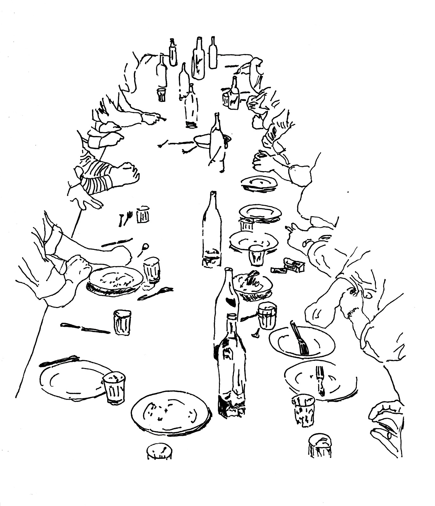

[home](index.md) | [issues](issue.md)  |  [about](about.md)  |  [submissions](submit.md)
# shop

Our shop operates on a good faith basis. To purchase copies please email diana [at] wetgrainpoetry.com with the following details:

1. Name
2. Number of copies
3. Delivery address

We will reply with an invoice including postage and post your copies to you when we receive your payment. 

If you wish to support the magazine, you can also pre-order a forthcoming issue.

1. Issue Six, Autumn 2025 - £9
2. Issue Five, Summer 2024 - £9
3. Issue Four, Summer 2023 - £9 (Sold Out)
4. Issue Three, Summer 2022 - £9 (Sold Out)
5. Issue Two, Summer 2021 - £9
6. Issue One, Summer 2020 - £9 (Sold Out)

  

