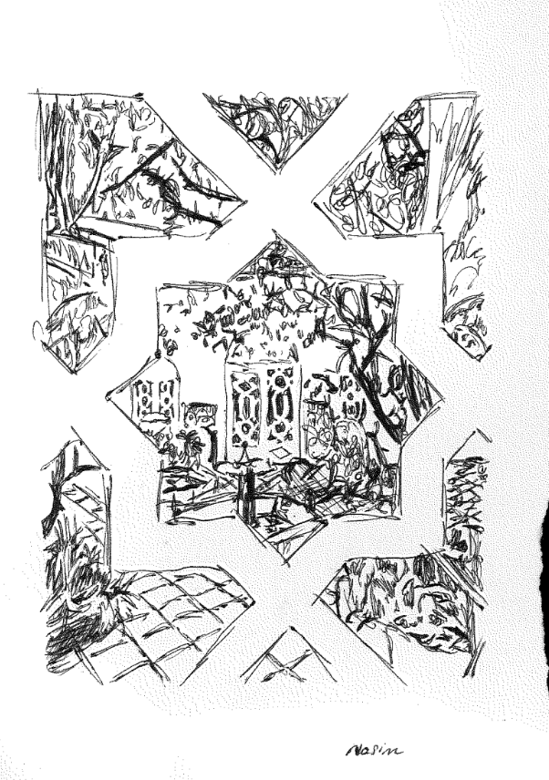
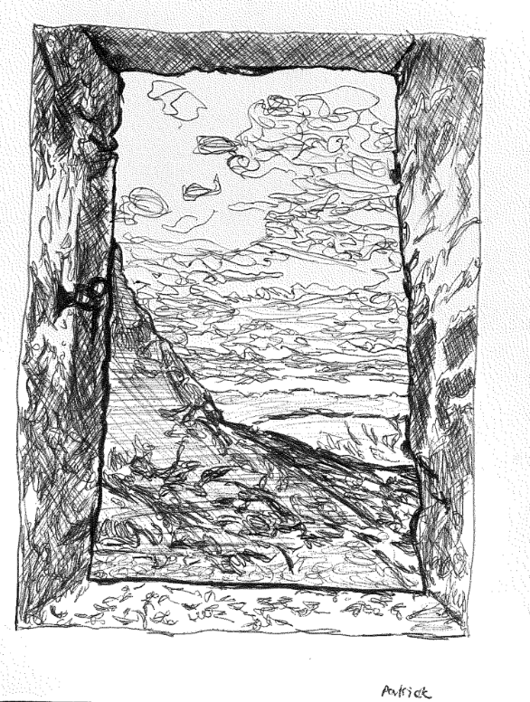
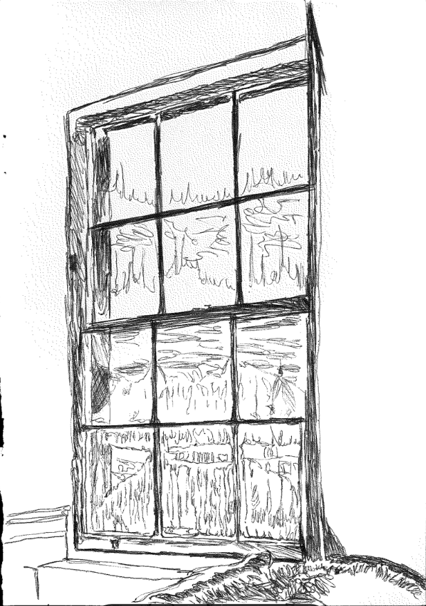

[home](index.md) | [issues](issues.md) | [about](about.md) | [shop](shop.md)  |  [submissions](submit.md)

  <a href="issueseven.html">back to ISSUE SEVEN</a>

 
 

### Stays  
 

**Patrick Romero McCafferty**: Nasim, I noticed the other night at dinner,
not for the first time, that when we’re asked where we live we both find it
hard to answer. I’ve not had a fixed address for the last year and a half or
so and I’m getting used to it but for ages, whether I was asked casually or
in confidence, it sparked a minor allergic reaction. A justification wanted to
form itself rather than a statement of fact. It makes sense not to want to be
held to an answer if I know it won’t hold true in a week but the reasons run
deeper than that. I believe in luck and I feel very lucky right now. I picked
figs in September, apples in October and starfruit at Christmas. I’ve pressed
cherry blossom, bougainvillea, and jacaranda in my journals. We ate our
dinner that evening on a Marrakesh rooftop and the day it struck me that we
should write a piece like this I was watching mariachis play in Coahuila. I’ve
wanted to kiss the soil in these months of movement and have. I’ve wanted
to kiss myself. But the oddness of it has also made me sheepish. 
 
Now I’m sustained by the conviction that movement of some kind or other
is just part of who I am and how I write. That I was right to give up the flat
I was able to rent with my partner for three years by sub-letting both the
bedrooms, splitting the rent, and eating from supermarket bins. The flat
was on the opposite side of the park to the flat I grew up in. I had to cross it
to get to the library and every day I’d pass younger Patricks on the avenues,
Patricks who went to Mexico every year but were still of the Meadows in a
big way. It was comforting to feel that I’d lived so much of my life around
that park but it would have felt stagnant if I’d stayed any longer. Now I’m
dispersed across bedrooms very distant from one another; my books and
jumpers left behind as a kind of assurance of return. Setting out to make
a living while writing, I feel, has made this untethering easier, with lots of
shuttling between Edinburgh and Glasgow, a long-distance job in Oxford,
and fairly regular visits to London: the numbers drawn from the tombola of
applications, collabs, and submissions that are seemingly part of the workload. 
 
Because we’re dual nationals, you and I are more than familiar with the
emotional arc of the seasonal visit. In adult life as in childhood, there’s been
an expectation from loved ones to be somewhere else for an extended period.
I wonder if like me, you feel that that migratory habit underpins your poetry.
I wonder too, how belonging to a time when travel is so shamefully affordable
plays into it. In some ways travel has become mundane. I vividly remember
the day I saw the Florida Keys, the entire East Coast of the States, then
Manhattan, Labrador, and the ice fields of Greenland in a single journey and
couldn’t take my eyes from the window. But the next time I made that trip,
it was just teleportation. I woke as we were landing. 
 
Equally, one evening I might be overwhelmed by the generosity of my host
and want to live forever in a state of perpetual guesthood, the following I
might be scheming to leave in pursuit of some kind of dominion over my
movements. With this way of living you have to be adept at the processes
and procedures of making travel cheap and reasonable, but you also have to
be really good at being a guest. You have to be thrifty as hell but not to the
extent you tuck yourself away from receiving unprompted kindness. It has
taught me to lean on people sensitively and let go of the horrible tit-for-
tat, the transactive logic that I’ve sometimes felt linger around friendships.
Living like this has been way cheaper than staying in Edinburgh would have
been without sacrificing time I’d like to spend writing to do cash-in-hand
labour for my brother or Deliveroo but I’ve had to adjust in other ways.
Without dependents, so far so free. 
 
A friend who’s recently moved to Edinburgh said she liked the way the
question’s phrased in Scotland: ‘where d’you stay?’ People mention this all
the time and I’m especially glad of it when I’m in Scotland now because it
lets me give a more honest answer: ‘I stay with my mate Jackson’ is true. ‘I
live with my mate Jackson’ would be a lie. But I don’t actually stay anywhere
either. I arrive slowly and then start leaving. 
 
So, from one itinerant to another, where d’you stay these days? And how is
it affecting your thoughts and writing? 
 
**Nasim Luczaj**: You’re so right about the unease around the question. I’ve
described my position as ‘drifting’ and ‘floating’, thinking of those verbs
benignly, as ways of moving through space pure and simple. Only once I’d
mumbled it a few times and seen my conversants’ responses did I notice an
undercurrent of giving away agency, and so maybe self-deprecation, as if I
were saying I had no say in where I was, no sense of purpose, and lacked
the maturity to commit to a place. The implication being: there’s a wind or
current propelling me, but not even strongly, and I let it do what it likes.
I’m not too opposed to that, as long as that wind is at least a cousin to what
I see as my life’s purpose. In Arabic, my name means ‘morning breeze’, and
mornings spent writing are indeed a great deal of what my life is about. 
 
I’ve been preparing for a life of movement since childhood. I went through a
phase of wanting to be a surgeon and fretting that I wouldn’t have the time
or energy to write; by the end of primary school, I knew I was going all in
on writing. I’d been prepared for the fluidity. Every year since I was a toddler,
the poet Cecilia Woloch would come to stay in our log cabin or down the
road, usually arriving from L.A. via Paris with, it seemed, only her laptop,
glistening silver on her lap. She was always on the move, teaching, reading
manuscripts, answering emails. We had a family desktop with Internet
pretty quickly, long before we got a washing machine, but a laptop with
fifty incoming emails a day still felt exotic in the rural early 2000s, and she’d
explain to me how frightful a box it was to open. I think of her as my ‘poetry
fairy godmother’: the figure who showed me without a doubt that such a life
was possible and what it entailed, introducing magical options while making
me aware of the trade-offs involved. A fairy godmother doesn’t just give you
a carriage – she tells you that you have to be home before midnight. 
 
On the Marrakesh rooftop, I remember you told me to say I was nomadic.
I struggle with that one, too. You’ve mentioned leaving books and jumpers
in other people’s flats and houses – all those books, all those jumpers –
which seems undignified of a nomad. I have so much respect for people who
genuinely live out of one backpack, with a strict one in, one out policy for
every book or item of clothing. I don’t work that way at all. 
 
Moving between places does feel natural to me, and it’s true that as a bilingual
dual citizen with close family ties on either side, I’d always felt inevitably,
radiantly splintered. I think most of us are and always have been straddling
different worlds, so none of what I’m about to say is special, but it is vital
context. My childhood home was very rural, and all the people who lived
around me, my closest friends, had such vastly different lives and points of
view from my family, who stood alone in their ways (we’d been described
as a sect and a local ethnic minority). I grew up in the woods, far from the
shop, visiting the UK once or twice a year to stock up on books and crisps,
and I dreamt of living there. If I had grown up in the UK, though, I’m not
sure I would have become a writer, at least not so fast. At home in Poland,
literature was the greatest joy available to me, and by writing in English, I
tapped into a longing for elsewhere. I’ve since lost the romanticism but still
perceive English as a joyous language. I try to write in Polish, but my felt
sense of it is murky, imbued with all the weight of the difficult parts of my
childhood. All the people I’m still afraid of. The schools I hated. Anyway, I
had all the peace and quiet, and I will always love remote places.
 
 
Right now, I’m at a month-long residency at Cove Park (thank you! I love
you!), trying not to step on frogs in the dark. My things are in Glasgow, in
Poland, and there’s half a bookshelf in London. Before a recent couple of
years in London, I was truly settled in Glasgow for eight years, and while
I love it deeply, it never felt right. The cold and damp depleted me, and
my poetry, too, runs on sunshine. Last September, I spent three days in
a shack in a Portuguese orchard, surrounded by scorched grass, with some
hills in the distance that reminded me of Georgia O’Keeffe’s New Mexican
landscape. I’ve been using her letters to write. One of the guiding themes of
her life was a tornness between a space in which she instantly felt right and
creative, and her beloved who lived and belonged up north. I can identify,
and subconsciously used her voice to channel this conundrum in my own
life. Maybe it’s the fetish of a girl who grew up in the woods to find an
arid, geologically dramatic, preferably coastal landscape more inspiring (soul-
prodding rather than pretty) than anything on earth, in a tie with the human
mind. I wrote more in front of that shack than I have in that amount of time
anywhere else.   

I’ve been in the full-blown in-between since last summer. Wherever I find
myself, nothing beats writing outside, whether while walking or sitting on
grass, a stump, a rock, sand. Most of what I write is notes on my physical and
mental environment, whose vitality I am trying to do justice to by means of an
unlikely phrase. Later, I mould these pieces into something more sculptural.
I’ve only started to give these tendencies proper thought recently, and this
will sound high-flown, but I’ve realised that phrases may come to me when
I’m in nature because fundamentally I’m harkening to a layer deeper than the
surface self, its concepts and sense of spacetime. I’m using as many senses as
possible to tap into a world resonating with life, its presence a whole other
language. I can feel the energy of the sun pour down into my writing.   

  

I’ve always spent a good three months of each year in places warmer than
the UK. I go to Poland for the better part of summer, and I’ve spent the past
few turns of August and September at my partner’s parents’ house in Veneto,
Italy, where we have a yearly ritual of playing at Teste Mobili, a really cute
and highly local music festival where I respawn as ‘the superstar international
Polish DJ from Glasgow’ – none of which rings true, but that’s the power of
word-of-mouth. I dream a lot about Venice (who has been and doesn’t?!) and
use dreams to assess a location’s imprint on my mental landscape. As a child
craving UK-ness, I often dreamt of portals from Poland to England. Over the
past couple of years, I’ve kept returning to Marrakesh, and I dream about it
all the time – arguably as much as the places I’ve *stayed* stayed at. The fantasy
novel map of my world would now need to include Marrakesh.   

The more keenly aware I am of my luck and the enjoyment I take in the
variety within my life, the more I wish it was easier for others to access these
kinds of untethering. I’ve never had a 9–5 job and hope I never will. Even so,
I’m digesting a lot of guilt. I shouldn’t be flying so much. I shouldn’t get to
soak all this up when others can’t. While you and I can do something valuable
with all these vantage points we have, there’s also something to the person
who never leaves their village – Alice Oswald spoke beautifully on that in the
Paris Review recently. Though I read and write to nudge myself and others
towards a blend of agnosticism and animism, the more I research Indigenous
ways of seeing the world, the more it jumps out at me that I will never have
the same relationship to land. Not only am I a fair-weather friend, I’m also
not reliant on the ground beneath my feet in the same way. I can walk to the
shop. Of course prolonged immersion and high-stake interdependence yields
a relationship you can’t get to otherwise. Hardly anyone in the modern world
can be so anchored to the natural environment. Even if we’re interested, most
of us are dilettantes.  

I don’t think my dilettante’s streak is ever going away. I want to peep into
new views, new facts, new languages, and glean. But I’m also quite sedentary
– I love easing into a place, creating a makeshift domestic life and then
dismantling it. As a baby, I had to be driven around in the car to fall asleep.
All these little traits add up to a kind of life working for you or not. I also
see myself as annoyingly suited to the gamified world you referred to. I’m a
born optimiser painfully aware of the numerical, whether time or money – I
still can’t look at the clock when I go to sleep, and never really watched films
or played games for fear of ‘wasting time’. I’m in the process of softening
this controlling streak, but I do keep seeing that the way our world is set up
reinforces those traits. If you have no one depending on you and the right
skill set, it really is the way to thrive, especially given ever-greater housing
issues just about everywhere, and how the model life proposed by our society
involves building our lives around a career on which we’re expected to spend
most of our lives’ hours. I’m not doing that if I don’t have to! I can feel the
clock ticking all the time. Do you think that in a world that didn’t expect you
to sacrifice your writing time and seeing your loved ones, where you could be
settled without compromising those, you’d still have this restlessness about
you?  

**Patrick Romero McCafferty**: Yeah, stillness is an ideal I’m just not in
a phase of life to appreciate fully. The only kind I consciously make time
for is on waking, when I sit with my journal or a book of poems and the
morning light for an hour. I’m making the most of feeling sleep-naive in
those moments. Once my waking mind kicks in, I’m summoned in half
a dozen directions. John Cage reminds us you can never fully experience
silence. The same’s true with stillness. Restlessness, as we were saying on
the phone yesterday, has unusually negative connotations, considering being
alive is a kind of restlessness. I’m very conscious of my body because of a
health condition, one of whose symptoms is poor sleep. From a young age,
physical movement has been the only way to gain control over an organism
that at times has had me completely at its mercy. So restless I am from head
to toe, in that alongside reading, going for a long run over Braids golf course
was probably one of the first independent things I knew I had to do. I don’t
care for it much as sport but that embodied, semi-metaphysical feeling I
get from self-induced exercise expresses itself in so many ways that aren’t
physical now too. When I went on those runs when I was wee, I’d be telling
myself a never-ending story in which I lived in a treehouse. I’m sad I don’t do
it anymore but maybe it stems back to that time that writing feels vigorous
in itself. Not laboured, necessarily, but satisfyingly fricative (nervous too, as
in, from or of the nerves) and I like it when I feel that vigour come across
when I read. I’ve not read the *Paris Review* piece, but Oswald’s voice is like
that for me, since you mentioned her. I love listening to her read from Dart.
Another word that surfaces with *Dart* is ‘drift’, of course. The eddies, white
water, and locks it passes through, carried by the force of the river. I found it
interesting how the way you used it to describe your movements made others
react. Drift is so calm. Driftwood drifts. A leaf in a stream drifts. I long for
that kind of relinquishment of control at times. Sometimes I jump in of my
own free will and inhabit my aquatic spirit animal, a school of mackerel.
More often something induces me to and I can’t help but.  

So I think the restlessness has and always will be there, but will very likely
shapeshift with time. Since last winter I’ve stayed intermittently in a room on the
Mile overlooking the street performers, laid bricks at an anarchist community
in the Portuguese hills, camped for two months around Lochaber, Berneray,
Orkney, and Shetland during the early summer heat wave, picked litter at a psy-
trance festival by a lake, stayed with my partner and her family in Ljubljana as I
have done almost every summer since I was eighteen, and now I’m in the crater
of an extinct volcano. I’m grateful for the grants that have made this possible
and I record practically every bus I take, noting where I’ve been, who I’ve met.
The pace may be quick but I don’t take it lightly.
  
Control and influence have been on my mind more having given up a space
that is more definitively mine or personal. I’m very territorial, funnily enough,
over the time I’d like to spend feeling unconstrained. When I sit down to write,
time washes and swills round that school of mackerel like the current. I doubt
I’ll ever write in measured blocks, as some might, but it obviously takes being
a bit fierce in other areas of life to allow myself that luxury. I’ve only really
become a bit territorial over space in the time I’ve been footloose. I shared
a bedroom with my brothers growing up and no knock-off football strip or
coloured pencil belonged to anyone, so I never really found sharing flats or
rooms difficult. I’m also not particularly dependent on a desk or chair to write
in either. I don’t mind where I am if there’s a gentle, steady soundscape. It’s
mainly in the rituals and courtesies of being a guest in someone else’s place
that I feel it now. But I get way too much from that to get frustrated about it
most of the time and I can find the right conditions fairly easily.  

Whatever sense of control I want to have over my work, it’s responding to
the musical and emotional influence of the circumstances it was written in. I
never know what I’m going to say or where I’m going to get the energy to say
it with. In Morocco, you mentioned feeling a strong current of uncertainty in
your thought, I think. Oddly, craft, which sometimes feels like the execution
of surety, runs on uncertainty for me. A poem doesn’t emerge from a
conviction, it emerges when I feel the sun of uncertainty on my eyelids,
taking form from what appears initially as a silhouette. When my life and
environment have been more predictable, uncertainty has imposed itself far
less, or at least it becomes harder to confront when I’m comfortably situated
in them both. *Glass Knot Sun* doesn’t have any poems about Edinburgh in it
simply because I haven’t written that many, even though I love that city and
feel like an OG there. I say this half-jokingly, but giving up the flat might
have been a flamboyant way of exposing myself to the states and emotions,
on various experiential levels, that motivate me to write: seeing a stray horse
walk onto on an abandoned football pitch; having my ass scrubbed in a
hamam; driving round and round the block with my cousin listening to the
songs he connects with the death of his dad. The abundance and beauty of
these bracing shifts in setting makes me ask why I should live like this while
others can’t, as you say. Rather than think of it as guilt though, I think of it
as shame, which is dignity’s shadow. Without a sense of shame, I wouldn’t
be accountable to anyone, and although I’m speaking to myself as I write, I’m
speaking to you too. I’m lucky and glad to call you my friend, so of course
I’d feel shame if I didn’t do so in good faith, in the hope that it means
something. Do you know what I mean? I think this true of the choices I’ve
made around where to go too. If I felt the value I could bring to others was
minimal then I wouldn’t do it.   

  

For what it’s worth, I only suggested nomad because we were in Marrakesh.
Having been brought up in Edinburgh, a city that has sooked up resources
and wealth from elsewhere for hundreds of years, it’s fair to say I’m disqualified
from using that term for my elective unhousing. No matter how clever I
think I’m being at saving money, the privileges have been extensive. I’ve
had a sense of that since I was small, moving between it and Mexico City.
Even though it’s always used in that despondent self-ironising way, I hate
the term ‘digital nomad’ almost as much as I hate what it’s doing to Mexico
City precisely for how ignorant it is to the platform of historic wealth and
stability it sits on — where’s the nomadism in being responsible for hiking
the rents? I admire economy in writing as in people too, and see a kind of
honour in doing things with restraint and intelligence. But at the same time,
it’d be daft to think my ability to write was in any way related to how much
I was spending at any given time. The spheres overlap but they’re governed
by different forces. I loved reading about how the shack was such a place
of abundance for you and how the landscape allowed you to relate in new
ways to O’Keeffe. Could it have been sustained, do you think, if you’d stayed
longer? And since you mentioned the need for both the rural and the city,
how do urban spells alter that generative possibility?

**Nasim Luczaj**: Oh, I think I could have gone on for a good few weeks.
That said, parts of my personality crave the city: not so much the poet but
the flaneuse, the clubber, the charity-shopper, the tentative novelist. Cities
rebalance and refresh, forcing a fallow period much like you would on a field,
either leaving it to rest or swapping out the crops. I’m gathering nutrients
by spending time with like-minded people, who can be hard to come by
in remote spots; I’m attending events and sensing the subtleties of where
we’re at as a society. Last night I was speaking to an artist who grew up
in a part of Athens that’s the most densely populated area in Europe, and
they’d cherished the experience: it got them out of their head, curbed their
self-centredness to see so much of all the ways human lives are going all
around you, all the time. You have to confront your preoccupations with how
things are on a larger scale. I loved this about London. One of my favourite
places was the Wavelengths pool sauna in Deptford, the most unembellished
and down-to-earth sauna possible, where lives rubbed against each other in
the dark, and I heard conversations I never would have had or even heard
anywhere but on film. Speaking of hot, under-cleaned places in London, I
also enjoyed the underground as a leveling space, the terrestrial equivalent of
a Danse Macabre, where no matter their status, everyone is forced to dance
together, if without looking one another in the eye.  

It’s interesting how often you mention the condition of guesthood. I think
of writing as oscillation between a heightened sense of connection and
disconnect. I write when I feel ‘plugged in’ to the world, but there is always
a hint of dissociation. As a child, I religiously wore an ‘ONLY VISITING
THIS PLANET’ badge. I bet most writers feel like outsiders, visitors; diary-
keeping guests keenly watching the world’s structure, the associated customs
and habits, the setting, the cast. There’s a fruitful tension between the
dissociative quality and moments of belonging, the yearning for connection
and dialogue. By now, you and I are probably addicted to the sensation of
being visitors; we’ve encouraged it so much throughout our lives.  

Fundamentally, we do absolutely belong to this world, no less than any other
entity; but there’s a sense in which each individual is indeed a guest, because
we hope and expect for our current iterations to pass away and let new people
enjoy it. Clearly, for hundreds of years now, Europeans have been terrible
guests. We’ve not treated our influence on the space we inhabit seriously
enough. We’re bent on leaving a trace, and no value is attributed to what
you leave intact, what you keep in equilibrium. A nomad and even a settled
member of an Indigenous culture is imbued with the latter. Not only is
it a value, it’s instinctual, inherited. You know not to eat up all of your
host’s pasta, even if you’d get away with it the first few times. We seem to
have lost accountability to our environment as a friend, though now, with
global warming, many people are feeling more and more like guests in that
sense. We know we need to tread carefully. (Still, whatever we do, there’s
always another guest staying here with us, who is totally off the rails, and the
tension is there. The confrontation won’t be pretty.)  

As much as I’ve presented a romantic image of growing into and relying on
one place, I’ve witnessed the level of disconnect within the rural community
I know best. My village is full of individuals who have never lived elsewhere,
sometimes barely set foot in the closest town. They may be connected to
the nature around them in ways a visitor from the city might not, but: the
accepted garden is land shorn to plain lawn with white cedars planted around
it. We had a family of refugees from Belarus staying in what used to be
my kindergarten, but they were evicted by the new village head, and when
they started asking around on Facebook about places to relocate, they were
met with a barrage of insults, many of which centred their unacceptably
untidy permaculture garden. Beautiful old oak trees form the rim of the
local cemetery, and recently there were voices to cut them down because they
are not straight and make a mess. Opinions in the village were split 50/50.
Many of the proponents of cutting had lived in the company of these oak
trees for forty, fifty, sixty, seventy years. The trees remain standing for now,
but the divide is painful to watch. Poland is also plagued by ‘revitalisation’
programmes. The city council will get a grant to remove all greenery from
town squares and public spaces, and replace it with concrete. The phenomenon
is so widespread that the disease now has a name – *betonoza*, or concreteosis.  

It’s hard to tell which sensibilities will prevail, but these situations have
led me to flirt with naivety, also within ‘nature poetry’. If we don’t know
how to celebrate other beings, wonky shapes, or even the fact that leaves
fall, then maybe we do need poems that state powerfully what might seem
obvious. Poems that carry, and bring all these elements to life, give them a
voice. Hopefully by travelling and feeling wonder at the different fruits and
animals, we’re pollinating others with appreciation for those things. I dream
of this happening on a wider scale, with love and respect for nature being fed
into the collective unconscious and prevailing sense of aesthetics through the
arts. Realistically, the measures would probably need to be more extreme; my
aunt said, of the villagers fighting to cut the oaks down, *we need to hypnotise
them.*   

  

I am well aware that the *Wet Grain* readership needs no hypnotising. We
don’t want to be didactic. Still, as a freshly budding editor, I can’t help but
feel some form of manifesto take shape within me as we speak. We’ve talked
balance and variety within our lives, and I’ve touched on equilibrium with the
nonhuman. I believe in something similar when it comes to selecting writing.
Each poem or essay is a place we travel to, and the form of a magazine or
anthology means that one type of piece can balance out another. There’s
space for the hearty and the heady, the extravagant and the quiet, and our
times seem to call for both. I firmly believe in the power of foregrounding
very different modes of relating to land: on the one hand, a turn towards
animism, simplicity, wonder, love of a landscape and the forces at play, and
on the other, bitter truths and insights into our past, present and future,
granularity of perception, lateral and difficult thinking, so that we can non-
trivially feel where we are and do something about it.  

Thanks for bringing me here, Patrick – both into the space of these questions
and into *Wet Grain*. This whole conversation has felt like a hike, turning so
many corners that open up view after view. And this is just the beginning!
