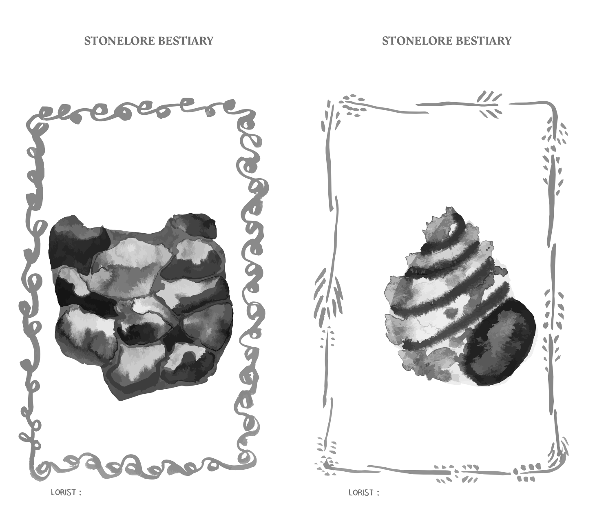
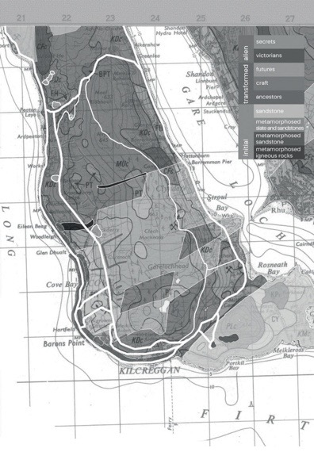

[home](index.md) | [issues](issues.md) | [about](about.md) | [shop](shop.md)  |  [submissions](submit.md)

  <a href="issueeight.html">back to ISSUE EIGHT</a>

 
 

## STONELORE: An Interview with Mathilde Dewavrin   

**Nasim Luczaj:** We met as we were starting our residencies at Cove Park in
February 2026. What brought you to Scotland and this residency in particular?   

**Mathilde Dewavrin:** When I first applied, I had in mind a land of stone,
strong winds, salty water. That was more than enough to convince me. I love
to listen to stones, pebbles, rocks; it’s been my main occupation over these past
few years.   

I started at a moment when the world no longer made sense to me, if it ever
had. You know this feeling when you hear all this awful news about the world,
when you consider the absurdity of cupidity, the money some individuals own,
the money needed to save others, and you end up submerged in a state of
helplessness because who are you, really, to still hope for change? It’s like
looking at a blurry picture, spinning on yourself, losing your grip, falling dizzy
to the ground, ending up in a fetal position staring blankly at the air in front
of you. And I mean the air, not the wall. Focusing on the air, attempting to
see it. I’m sure you’ve experienced such states, between full awareness and
complete emptiness. It was in one of those moments that stones began to
make complete sense to me.  

I was working on a project around heritage and untold stories. Most of the
stories I discovered back then were linked to the heritage building’s material:
stones. It felt like digging in time and scale. Plants and small ecosystems would
develop on top of and in between the stones. But before that, people used to
kill all the plants to make the heritage site look as it had originally. And before
that, the stones were carved, techniques transmitted. Before that, a mortar
would be used to consolidate walls, but also to defend the fortress. Before that,
revolutionaries stole the stones to build their houses. Before that, stones were
carried and put together by people who would end up dying in the process.
Before that, stones were quarried out of the mountain by the sea and put
on ships. Before that, layers of sediment accumulated and slowly turned into
minerals. Before that, there was an ocean, and creatures would swim around
before dying and decomposing on the ocean floor.  

It hit me that stones are living things if you consider the timeframe in which
they have been around. They are moving, changing, evolving. A friend of mine
said: ‘we deserve extinction’. Stones were here long before us, and they will be
there long after us. This thought transmitted an almost soothing feeling; we
are a tiny part of this world, we will be gone one day and the rest will remain.
So I guess that’s what drew me to Scotland: it’s a land of stones.  

​ 

**NL:** I love the idea of listening to stones. What did the stones around Cove
Park have to tell you? How did you find a way into their stories? I remember
you cycling off in the rain to meet them.  

**MD:** I must say it feels as if they found their way to me. I first noticed dykes
on the train to Cove Park: dark lines in the landscape, not quite straight,
not well maintained, but still very present. They cut the hills up into smaller
patches. I remember thinking they were like scars. It was only once I arrived
at the residency that it became clear to me that those grey lines traced on
the landscape were going to become a central element of my research on
site. Wherever I went, I couldn’t help noticing them. They reminded me of
restanque, an ancient Provençal craft practised in the south of France, where
I come from. Restanques are dry stone walls built to create terraces in order
to cultivate the sloping land. That’s when I started cycling around, meeting
locals and exploring the local library for stories of dykes. Of course, I loved
their name.  

In Scotland, dykes are a trace of the myriad ways land has been used and
divided by all peoples who have inhabited it: from Viking harbours to
sheilings, famine walls to folleys. Their existence opens a whole chapter on
potential commonalities between visions of ownership before the concept of
private property was generalised. Dykes leave clues and keys to interpret our
past attitude toward privacy, husbandry or even neighbourliness. I was more
specifically struck by the dykes put up during the Highland Clearances to 
confine the sheep and cattle that was replacing the local population, or used
by landlords to divide what used to be land for the whole community. I sensed
an echo with Algeria, where the uses of the land for feeding the people were
not linked to a single person’s property, making it easy to claim by French
colonialists when they arrived and asked Whose lands are those? and were
answered No one’s. It echoes with Canada, where land-owning was a nonsense
to First Nations, and land was considered its own owner. In Scotland, dykes
are both witnesses and tools, which turn them into very complex symbols of
Scottish history.  

Dykes are a craft, and there are people who work very hard to stop it from
disappearing. While at Cove Park, I met Britta and Patrick, two dry stone
wallers building on the Rosneath Peninsula and in the surrounding area.
Meeting them was a truly beautiful experience. They explained how the act of
building dykes was for them a way of creating new niches for ecosystems to
develop, as well as a very locally sourced enterprise. They build only with stones
found on site.  

Dykes are not the centre of interest to Rosneath Peninsula’s visitors. Tourists
tend to prefer the outrageously gorgeous Victorian houses. Built by rich
merchants from Glasgow, their stones were carved with colonial money.
They carry names, and we remember the architects behind them. Dykes are
anonymous. They make themselves forgettable whenever vegetation grows and
earth accumulate on top of them. They turn into secret hills, but not quite
silent, if one takes time to notice them and read their stories.  

A lot of the people on the peninsula had stone-related stories and considered
them as part of their own history. I suggested that we write them down and
use the collected fragments to put together a Stonelore – a many-voiced stone
bestiary. N.K. Jemisin’s Broken Earth trilogy made quite an impact on me, so
I responded with my own version of a collective Stonelore.  

**NL:** I remember finding out about the Clearances only after coming to
Scotland, too, and generally embarking on the never-ending mission to learn
to read the landscape better. What kept drawing my attention while at Cove
Park is the alarming proximity of military bases and nuclear weapons, right
round the corner, tucked into the idyllic landscape and so near to those houses
that are, as you say, outrageously gorgeous. And just as deep time lives in the
stones, those places make the mind wander to an at least as dramatic future.
Did that affect you at all? <br?

And, on a nicer note, what’s your favourite stone story? I love that you called
it a bestiary.   

**MD:** I must admit that the military presence on the peninsula was one of
the reasons I applied. In my work, I seek ways to disarm or at least question
dynamics of power by listening and reclaiming space (with words and bodies).
The military is a very good entry point, because their power is obvious; they
are a symbol of authority, feared by most, celebrated by others. But being
there, looking for traces of military presence, I was constantly and inevitably
drawn to the conclusion that it was well hidden. Putting my feet in the loch,
I kept thinking that I was sharing the water with a submarine. Walking in the
forest, I wondered when I would be stopped by a fence decorated with cameras
and razor wire. Biking on the roads, I looked for military cars and shelters. I
was forced to come to the conclusion that they were everywhere and nowhere
at once. Ungraspable.  

During this time, the US started to attack Iran, and the fact that I was sleeping
right next to a warhead storage facility didn’t make my dreams easy. Not that I
felt endangered, it was more of a feeling of helplessness, weariness of humans
and their power moves, power tools and power cruelty. All in all, going back
to looking at the stone had been my best strategy. At least, by telling their
stories, I have the feeling of doing something that has meaning. They will be
there long after we are gone, after all, and they must be much wiser than us.
Which leads me to my favourite stone story from Cove Park’s Stonelore. I was
very curious about a rock formation on the beach and had the great chance to
discuss it with a geologist. Here is what he told me:  

*Let me tell you this. A geologist is none other than a storyteller, and I’m telling
you this as a geologist myself. We look at real elements of course, and we do
justify our theories with evidences. But you have to imagine; the land before
you has been going through massive transformations, and what we see now is
really just a snapshot of how it looks today. Erosion took a great part of the
evidence away, and tricked us many times into telling the wrong story. Entire
layers of stones have been wiped out by the infamous trio of time, wind and
water, and they now sit at the bottom of the northern sea in the form of sand
or clay. We have no choice but to guess. So we build stories, and sometimes
they compete against one another, so we have to choose. The tilted rocks on
the shore hold many stories. But to be honest, I simply think mine is better.
I simply loved the posture he took, very situated, humble and even poetic. It
almost made me want to write a novel based on geology theory.*   

**NL:** I’m curious – what was this geologist’s theory vs other people’s? Are there
any major conflicting geological theories that apply to Rosneath Peninsula? 
I agree that so much in a landscape is implicit and, as you said of the military
presence, everywhere and nowhere. Until we learn to perceive it, and then it’s
everywhere. You need to know how to look, and once you unlock a certain
kind of knowledge or perception, everything begins to speak. It sounds like
an intense unlocking, a whole new plane added to your perception. How is it
to be back home with all that new perspective? Has Scotland changed your
perception of the ground beneath your feet, the particularities of your own
place?   

**MD:** I love this question. Yes, it did change quite some things… But first, the
geologist. The rock formation we were talking about are some tilted rocks, on
the shore. The easiest way to describe them is to compare them to lasagna: layers
on top of each others, but tilted, angled, as if the whole plate had encountered
an obstacle and started rising. This is more or less the common theory. He
believes that the lasagna encountered an obstacle but actually started to bend
towards the earth’s centre, creating a roll, and that erosion eliminated the top
part of this lasagna-roll throughout the years, which would explain why we
only see its tilted ‘sides’. In the end I trust his theory more. Knowing how
intense the wind and rain is over there, it’s easy to imagine an intense erosion
process.   

Now I’m back in Marseille, far away from rainy-windy Scotland, and a massive
heatwave is taking over Europe. I’ve turned my flat into a cave; shutters closed,
ventilators on, I cover myself with wet towels. In these moments, I think of
my grandad who used to dream of building bories: dry stone shepherd huts
typical of the south of France. Thick walls, almost no windows, half dug into
the ground, cold and dark, made of locally sourced stones. The art of building
bories is a disappearing craft. In his opinion, they were one of the solutions to
climate change: avoiding transport of building material, letting houses decay
and embrace change, using the thermoregulatory and insulating properties of
stones, accepting darkness to rest from intense sun. The voices of the dry-stone
wallers resonate with me:   

*we do dry-stone walling because we think it’s one of
the few jobs that don’t hurt people, don’t hurt plants,
don’t hurt insects. We do dry-stone walling because it’s
a shelter to the more than human. We do dry-stone
walling because it cannot be effective, it cannot be
extractivist, it cannot be taken by capitalism.*   

While in Scotland, I always thought of crafts related to dry stone as disappearing
in the south of France. Now that I’m back here, I want to chase their remnants,
the knowledge still to be transmitted and explored. Because if Patrick and 
Britta exist in Scotland, I’m sure their cousins are building a borie in a small
Provençal village, enjoying the shade it brings and the coldness it holds within
its thick walls.
  

​ 

  

