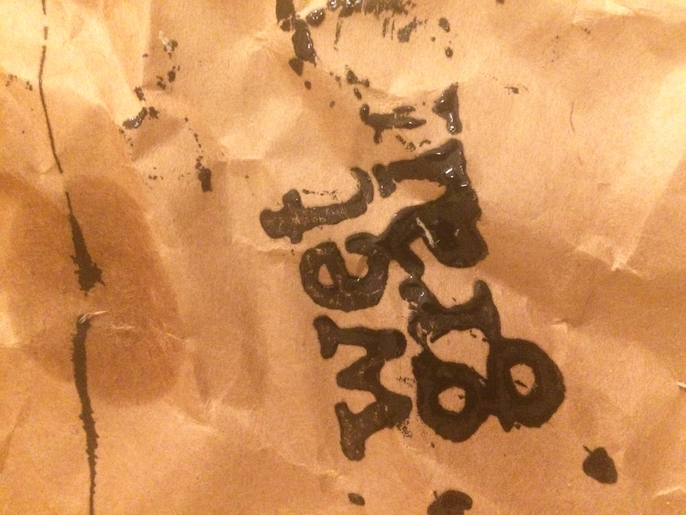

[home](index.md) | [archive](archive.md) | [shop](shop.md)  |  [about](about.md)

# submissions

We will be open again for submissions of poetry and prose from 1st December 2025 until the 31st January 2026.

​
General Guidelines:

1. Please send up to five shorter poems as a .doc or .docx (30 lines or less) via email to wetgrainpoetry [at] protonmail.com with your name in the title of the document.
2. We are currently looking for essays (max. 3000 words) & reviews (max. 1500 words) of contemporary poetry only.
3. We welcome submissions in translation provided permission has been obtained to publish the original.
5. We welcome simultaneous submission. Please notify us immediately if your work is accepted elsewhere.
6. If you haven’t already, we encourage prospective contributors to familiarise themselves with the types of poetry we publish by buying a copy of [a previous issue](shop.md).
7. If your work is accepted we might ask you to contribute a) a short note on a poem included in the issue or b) a flash essay. Please indicate whether you'd be interested in contributing to these important features of the magazine in the body of your email.
8. We encourage and actively seek work by poets from underrepresented and marginalised backgrounds.
9. We're unable to offer payment for contributions at this time, though we hope this will change soon.

